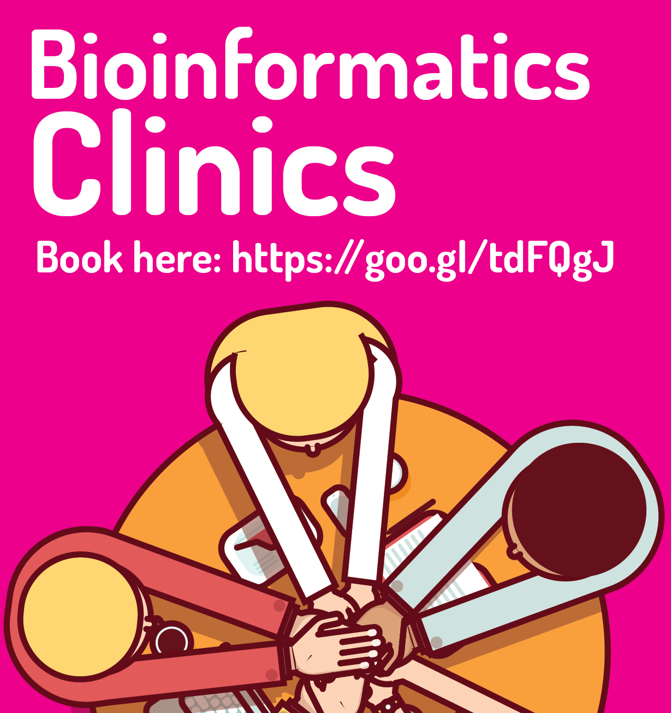

# Bioinformatics Clinics held fornightly at Sheffield University

The Sheffield Bioinformatics Core team are currently holding coding clinics available every fornight on Mondays at 2pm and 3pm. The clinics are available for **all Sheffield University researchers and students** to get help and support with bioinformatic and data analysis problems. At each session members of the Sheffield Bioinformatic Core will be available to offer help and advice.

[**Please book here!**](https://goo.gl/forms/JdIxBC4SCB6S8LB63)

## We can help with:
- Coding issues and improvements
- Submitting jobs on the HPC
- Data visualisation
- Experimental design
- Help with accessing large data

