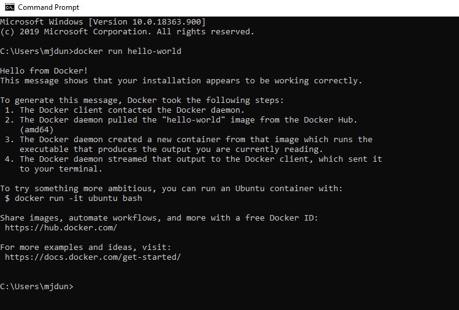
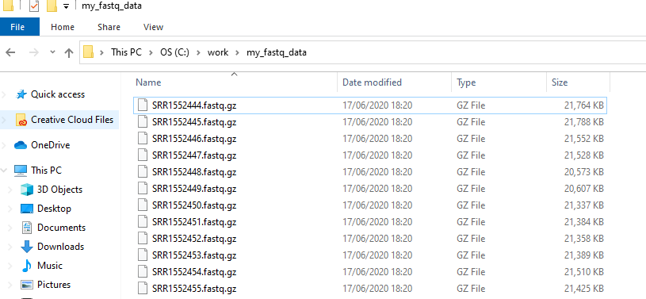
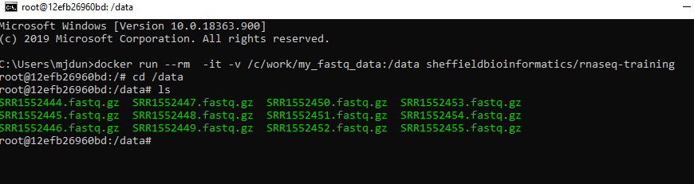
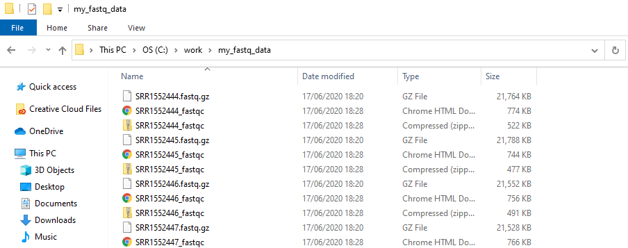

# Introduction

Installing Bioinformatics tools can be a major headache and frustration; even for experienced Bioinformaticians. In this brief tutorial we explain how you can run command-line Bioinformatics tools on your own desktop / laptop, or University of Sheffield computing cluster, with minimal setup. 

It will be assumed that you have some familiarity with the Unix command-line interface, and know what commands you want to run. You can get a primer from the Software Carpentry organisation for example.

- [Software Carpentry](https://swcarpentry.github.io/shell-novice/)

The particular example we will give is for an RNA-seq analysis

# Setup on your own machine

A Virtual-Machine approach (e.g. using VirtualBox) could be used, but we will consider a solution using Docker.

Docker is an open platform for developers to build and ship applications, whether on laptops, servers in a data center, or the cloud. It is a (relatively) painless way for you to install and try out Bioinformatics software. You can think of it as an isolated environment inside your exising operating system where you can install and run software without messing with the main OS.


## Installing Docker

Choose the appropriate link below to install docker on your machine

### Mac

- [Mac OSX - 10.10.3 or newer](https://www.docker.com/docker-mac)
- [Older Macs](https://download.docker.com/mac/stable/DockerToolbox.pkg)

### Windows

- [Windows 10 Professional / Educational](https://www.docker.com/docker-windows)
- [Other Windows](https://download.docker.com/win/stable/DockerToolbox.exe)

Once you have installed Docker using the instructions above, you can open a terminal (Mac) or command prompt (Windows; search for the CMD program) and type the following to check that everything is working

```
docker run hello-world
```




### Using the environment to analyse your own data

`hello-world` is a pre-built container that prints a "Hello world" message to the screen. Many popular software (not just Bioinformatics) and pipelines are distributed using docker and in particular the [dockerhub](http://dockerhub.com/) website. Our container for RNA-seq analysis is available at `sheffieldbioinformatics/rnaseq-training`.

With the default settings, the "container" is isolated from your own machine; we can neither bring files that we create back to our own OS, or analyse our own data.

However, adding an `-v` argument allows certain folders on your own OS to be visible within the environment. 

Lets assume the files I want to analyse are to be found in the folder `/c/work/my_fastq_data`. Here's what the files look like on my Windows machine



The following command would map that directory to the folder `/data` inside the docker container

```
docker run --rm  -it -v /c/work/my_fastq_data:/data sheffieldbioinformatics/rnaseq-training
```

*N.B. the other options being used here are --rm to delete the container afterwards, and -it to make it interactive*.

We now should be able to see our files with the `ls` command on the directory `/data/`.

```
cd /data/
ls
```




If I now want to run `fastqc` to perform a QC check on my files, the `fastqc` tool is available to us.

```
cd /data
fastqc *.fastq.gz

```
Conveniently the results are appear in the directory on our Windows machine



Other tools that are available include:-

```
multiqc
hisat2
salmon
kallisto
featureCounts
STAR
htseq-count
```

When you have finished with analysis, type `exit` and close the command prompt.

```
exit
```

# Analysis on the UoS cluster

As described above, `docker` can be used to run the environment presented in this course on a personal laptop. However, there are some security implications of docker that prohibits it being installed on a high-performance computing system. An alternative is `singularity`, which allows computing environments to be distributed as a single image file. We have created such a singularity image for the analysis of RNA-seq and made it available on sharc (The University of Sheffield's HPC).

If you don't already have one, you will need to request an account on sharc.

https://www.sheffield.ac.uk/it-services/research/hpc/register

The UoS website has documentation on connecting to the HPC and transfering data.

https://www.sheffield.ac.uk/it-services/research/hpc/sharc

## Connecting to the cluster

On my Windows machine I use the free tools putty and WinSCP to connect to the cluster

- [WinSCP](https://winscp.net/eng/index.php)
- [putty](https://www.chiark.greenend.org.uk/~sgtatham/putty/)


Firstly, login to sharc in the usual manner and then open an interactive shell.

```{bash eval=FALSE}
ssh USERNAME@sharc.shef.ac.uk

## open an interactive shell wiht 6Gb of RAM. Change as required

qrshx -l rmem=6G
```


Standard Unix commands (e.g. `ls`, `cd`, `pwd`, `wget`...) are already available when you first login to `sharc`. However, the tools specific to NGS analysis will require you to prefix the path to the singularity image before the command to run the tool.

To save typing to path to the singularity image can be saved as a variable

```{bash eval=FALSE}
export IMAGE_BASE="singularity exec /usr/local/community/bioinformatics-core/singularity/rnaseq-training.sif"

```

## Example workflow

Lets say that I have some `fastq` files in the folder `/fastdata/md1mjdx/my_fastqs`

```{bash eval=FALSE}
cd /fastdata/md1mjdx/my_fastqs
$IMAGE_BASE fastqc *.fastq.gz
```

Other commands that require you to list give the path to the singularity image are as follows:-

```{bash eval=FALSE}
$IMAGE_BASE multiqc
```


```{bash eval=FALSE}
wget 
```


```{bash eval=FALSE}
$IMAGE_BASE salmon index
```

```{bash eval=FALSE}
$IMAGE_BASE salmon quant
```


### Other example commands


```{bash eval=FALSE}
$IMAGE_BASE hisat2-build
```


```{bash eval=FALSE}
$IMAGE_BASE hisat2 
```

```{bash eval=FALSE}
$IMAGE_BASE STAR
```

```{bash eval=FALSE}
$IMAGE_BASE samtools 
```

```{bash eval=FALSE}
$IMAGE_BASE featureCounts
```

```{bash eval=FALSE}
$IMAGE_BASE htseq-count
```

```{bash eval=FALSE}
$IMAGE_BASE kallisto
```
