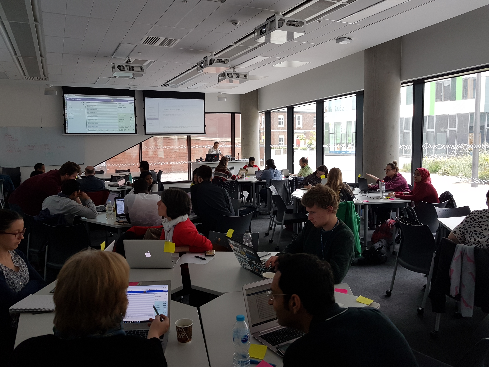

To be the first to hear about our training course program and for other core news and annoucements please join our mailing list [here](https://groups.google.com/a/sheffield.ac.uk/forum/#!forum/bioinformatics-core-news/join). 

---
<!--You can also tell us about what courses you would like to attend in the future by [filling in this form](http://goo.gl/97fZGt)-->

Unless specified, all the courses listed below take place in Sheffield. We can also run courses at other sites if there is sufficient interest. If you would like us to run a training course at your institute / site, please [contact us](mailto:bioinformatics-core@sheffield.ac.uk)

At the moment our workshops have online and in-person attendance options available. If you chose to attend online you will have access to main instructor's screen online. There will be demonstrators online to assist if you have any issues.

Our current teaching format is to run shorter sessions split over multiple days. This is to allow participants time to review the materials in-between sessions.

---

If you are based in Sheffield and want 1:1 advice on data analysis, experimental design or any Bioinformatics problem, you can [book a clinic with us](https://sbc.shef.ac.uk/blog/clinics/)

We have also made a curated list of other training materials available online and an FAQ for support queries we are receiving at the moment

- [http://sbc.shef.ac.uk/training/other-materials](http://sbc.shef.ac.uk/training/other-materials)
- [FAQ](http://sbc.shef.ac.uk/training/faq)

## Upcoming (more to follow soon)

## 2023

- [Introduction to the Command line for Bioinformatics](https://sbc.shef.ac.uk/training/command-line-2023-01-16), 16th January 2023, **IN-PERSON** and **ONLINE**, Booking Soon
- Analysis of 10X single-cell data in R, January 2023, Dates to be confirmed
- Data Manipulation and Visualization in R, February 2023, Dates to be confirmed

## 2022

- [Introduction to RNA-seq analysis in R](http://sbc.shef.ac.uk/training/rna-seq-in-r-2022-12-12), December 12th,December 14th and December 16th, **IN-PERSON** and ONLINE, [Book now](https://onlineshop.shef.ac.uk/conferences-and-events/faculty-of-medicine-dentistry-and-health/medical-school)

## Past Courses

## 2022
- [Data Manipulation and Visualization](http://sbc.shef.ac.uk/training/r-introduction-online-2022-09-19), September 19th, 21st and 28th 13:00 - 16:00, ONLINE and in-person attendance available
- [Introduction to RNA-seq analysis](http://sbc.shef.ac.uk/training/rna-seq-introduction-online-2022-09-12), September 12th 13:00 - 17:00, ONLINE and in-person attendance available
- [Introduction to RNA-seq analysis in R](http://sbc.shef.ac.uk/training/rna-seq-in-r-2022-06-13), June 13th,June 15th and June 17th, **IN-PERSON**
- [Introduction to NGS and Bioinformatics](http://sbc.shef.ac.uk/training/ngs-introduction-2022-05), May 16th, 18th and 20th,  ONLINE
- [Data Manipulation and Visualisation](http://sbc.shef.ac.uk/training/r-introduction-online-2022-04-26), April 26th, 27th and 29th, ONLINE
- [Analytics 2 - Introduction to the Command line for Bioinformatics](https://www.whiterose-mechanisticbiology-dtp.ac.uk/training-and-events/upcoming/analytics-2-introduction-to-the-command-line-for-bioinformatics-2022/), March 24th, White Rose Mechanistic Biology Students ONLY
- [Data Manipulation and Visualisation](http://sbc.shef.ac.uk/training/r-introduction-online-2022-01-11), January 17th, 18th and 19th

## 2021
- [Introduction to NGS and Bioinformatics](http://sbc.shef.ac.uk/training/ngs-introduction-2021-11), November 29, December 1st and December 6th, BOOKING SOON
- [Data Manipulation and Visualisation](http://sbc.shef.ac.uk/training/r-introduction-online-2021-10-11/), October 11th, 13th, 15th
- [Statistical Analysis in R, September 22nd, 1pm to 5pm](https://sbc.shef.ac.uk/training/stats-introduction-2021-09-22/), ONLINE, 
- [High Performance Computing for Healthcare](https://n8cir.org.uk/events/hpc-healthcare/), July 12 and 14th. In collaboration with [RSE Sheffield](https://rse.shef.ac.uk/).
- [Data Manipulation and Visualisation](http://sbc.shef.ac.uk/training/r-introduction-online-2021-07-19/), July 19th, 21st ,23rd.
- [RNA-seq analysis in R](https://sbc.shef.ac.uk/workshops/rnaseq-r-online_v1), May 17th, 19th and 21st
- [WhiteRose Mechanistic Biology DTP - Analytics 2 - RNA-seq analysis in R](https://sbc.shef.ac.uk/workshops/whiterose_analytics2_v1/), ONLINE, April 26, 28, 30, and May 4
-  Statistical Analysis in R, April 21st
-  Data Manipulation and Visualisation, April 12th, 14th and 16th 13:00 to 16:00,
- [NIHR BRC Data Analytics Workshop - Data Management, R and Statistics](https://sbc.shef.ac.uk/brc_training_feb21/), ONLINE, February 15, 17, 19, 22 and 24th, 
- [NIHR BRC Data Analytics Workshop  - Data Management, R and Statistics](https://sbc.shef.ac.uk/brc_training_jan21/), ONLINE,  January 11, 13, 15, 18 and 20th, Invitation only

## 2020

- [Statistical Analysis in R](http://sbc.shef.ac.uk/training/stats-introduction-2020-03-05/), March 5th
- [Data Manipulation and Visualisation](http://sbc.shef.ac.uk/training/r-introduction-2020-03-03/), March 3rd
- [Introduction to R and Prostate Bioinformatics](https://sbc.shef.ac.uk/training/prostate-bioinformatics-2020-02-18), February 18/19/20th, **University of Oxford**
- [RNA-seq Analysis in R](http://sbc.shef.ac.uk/training/rna-seq-in-r-2020-02-13), February 13th
- [Introduction to the command line for Bioinformatics](http://sbc.shef.ac.uk/training/command-line-2020-02-12), February 12th
- [Essential Data Analysis Skills for Researchers](http://sbc.shef.ac.uk/training/data-essentials-2020-01-20), January 20th/21st

## 2019

- [RNA-seq Analysis for Beginners](http://sbc.shef.ac.uk/training/rna-seq-introduction-2019-12-09/), December 9th
- [Nanopore Sequencing & Data Analysis](http://sbc.shef.ac.uk/training/nanopore-sequencing-2019-12-03/), December 3rd / 4th
- [Nanopore Sequencing & Data Analysis](http://sbc.shef.ac.uk/training/nanopore-sequencing-2019-09-19/), September 19th
- [Statistical Analysis in R](http://sbc.shef.ac.uk/training/stats-introduction-2019-09-18/), September 18th
- [Data Manipulation and Visualisation](http://sbc.shef.ac.uk/training/r-introduction-2019-09-17/), September 17th
- [Data Manipulation and Visualisation](http://sbc.shef.ac.uk/training/r-introduction-2019-07-19/), July 19th
- [Northern BUG Bioinformatics trainers workshop](http://sbc.shef.ac.uk/training/training-network-2019-07-09), July 9th/10th
- [Best Practices for Data Management](http://sbc.shef.ac.uk/training/data-management-2019-07-02/), July 2nd
- [RNA-seq Analysis for Beginners](http://sbc.shef.ac.uk/training/rna-seq-introduction-2019-06-10/), June 10th
- [Introduction to Genomic Variant Interpretation](http://sbc.shef.ac.uk/training/variants-introduction-2019-05-30), May 30th/31st
- [Introduction to Cancer Somatic Analysis](http://sbc.shef.ac.uk/training/somatic-variants-introduction-2019-05-10), May 10th
- [Data Manipulation and Visualisation](http://sbc.shef.ac.uk/training/r-introduction-2019-03-29/), March 29th
- [RNA-seq Analysis for Beginners](http://sbc.shef.ac.uk/training/rna-seq-introduction-2019-03-04/), March 4th
- [MSC in Genomic Approaches to Drug Discovery- Introduction to R](http://sbc.shef.ac.uk/gadd-bioinformatics), February 18th/20th/22nd
- [Introduction to RNA-seq in R](http://sbc.shef.ac.uk/training/rna-seq-in-r-2019-01-14), January 14th/15th

## 2018

- [Introduction to RNA-seq in Galaxy](http://sbc.shef.ac.uk/training/rna-seq-introduction-2018-12-17), December 17th
- [Introduction to R](http://sbc.shef.ac.uk/training/r-introduction-2018-12-10), December 10th
- [Introduction to Genomic Variant Interpretation](http://sbc.shef.ac.uk/training/variants-introduction-2018-11-06), November 6th/7th
- [Introduction to Statistical Analysis](http://sbc.shef.ac.uk/training/stats-introduction-2018-10-24), October 24th
- [Introduction to R](http://sbc.shef.ac.uk/training/r-introduction-2018-09-20), September 20th
- [Analysis of RNA-seq data in R](http://sbc.shef.ac.uk/training/rna-seq-in-r-2018-07-09/), July 9th/10th
- [Introduction to identifying and characterising variants from NGS data](http://sbc.shef.ac.uk/training/variants-introduction-2018-06-04/), June 4th/5th
- [Introduction to R](http://sbc.shef.ac.uk/training/r-introduction-2018-03-26/), March 26th
- [Introduction to RNA-seq](http://sbc.shef.ac.uk/training/rna-seq-introduction-2018-03-27/), March 27th
- [Best practices in Research Data Management for Biological Sciences](http://sbc.shef.ac.uk/training/data-management-2018-04-30/), 30th April, 

## 2017

- [Introduction to R and Bioconductor](r-introduction-2017-12-07), December 7th, Pam Liversidge Design studio 1 (D06), Sheffield
- [Data Manipulation and Visualisation in R](r-tidyverse-2017-12-15), December 15th, Pam Liversidge Design studio 2 (E06), Sheffield

