# Groups

|Group|Attendee|
|---|---|
|Group 1|Thushan de Silva|
||Saikou Y Bah|
||Alex Keeley|
|Group 2|Joby Cole|
||Daniel Bose|
||Frances Pick|
|Group 3|Ellie Harrison|
||Haya Almutairi
||Luke Geen|
|Group 4|Emmanuel Amabebe|
||Megan Cavanagh|
||Neha Kulkarni|

# House-Keeping

* Coffee and lunch are provided courtesy of DNAGenotek
* Please read and sign relevant health & saftey documents you have been provided
* All the course material can be found in this document (i.e. no slides)
* Practical steps are highlighted with <span style="color:purple">purple headings</span>
* You should have a copy of the course handbook, this is yours to take away with you

  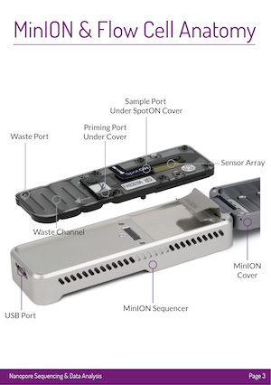

------

# Agenda

We have a packed day of practical and bioinformatic analysis. Here is the rough plan:

|Start|End  |Session      |Handbook Page|
|-----|-----|-------------|-------------|
|09:00|09:15|Health & Safety Introducton and Risk Assessment|Page 2,12-18|
|09:15|09:45|Introduction|
|09:45|10:30|Quantification & Preparation of PCR Reaction|Pages 5-6|
|10:30|10:45|Coffee (Provided)||
|10:45|12:00|Nanopore Basics (& Data)||
|12:00|13:00|Lunch (Provided)|
|13:00|14:00|Clean-Up & Loading of Flow Cell|Pages 7-11|
|14:00|15:00|Data Analysis Practical||
|15:00|15:15|Coffee (Provided)||
|15:15|17:00|Data Analysis Practical Continued||
|17:00|17:30|Course Wrap-Up||

We will be fairly flexible here as we cannot always gaurentee lab work will run to time.

------

# Introduction

Nanopore sequening is a third generation sequencing technology, capable of sequencing large fragments of DNA to increasing quality.

During this course you will carry out the following:

* Quantify your DNA (or community standard)
* Run a 16S PCR on your DNA
* Clean-up your PCR product
* Prepare & load a MinION flowcell
* Sequecnce your library
* Analyse your data and determine the species composition

*It is our aim not to provide you with a comprehensive understanding on all nanopore sequencing has to offer, but enough of an introduction that entry into the world of long reads does not seem so daunting.*

>The 16S part of this course is based upon the excellent, recent, publication by Pollock *et.al.*: ["The Madness of Microbiome: Attempting To Find Consensus “Best Practice” for 16S Microbiome Studies"](https://aem.asm.org/content/84/7/e02627-17). This review provides an excellent introduction to 16S microbial species identification, and attempts to reach some conclusions about best practice.

Because the course runs over 1 day what we really want you to go away with is:
* Nanopore sequencing if accessible
* Nanopore sequencing is pretty straightforward
* 16S sequencing is one quick application
* Data analysis while somewhat challenging, is achievable.

------

# Quick Overview of Today's Experment

*We'll go into more detail later, but we need to get the PCR started so that we are generating data by early this afternoon.*

The practical steps today involve the following: 

1. Quantify DNA
2. Carry out 16S PCR
3. Clean-up PCR
4. Prepare flowcell
5. Load library
6. Sequence sample

------

# Today's Experiment (Part 1)

Let's get started with today's experiment. We'll talk more about nanopore sequencing and the data it produces while the PCR runs.

We will be sequencing the 16S gene of the bacterial species in your samples to help us find out what species are in the sample.

We'll be sequencing PCR amplicons from the samples you may have brought, the community standard we have provided and also a PCR blank. So label up the correct number of 0.2ml PCR tubes.

We will be *barcoding* your samples. This adds a tag, unique to each sample, to the 16S amplicons. This means we can run multiple samples on the same flow cell, saving time and money. We will split the samples out bioinformatically later in the process.

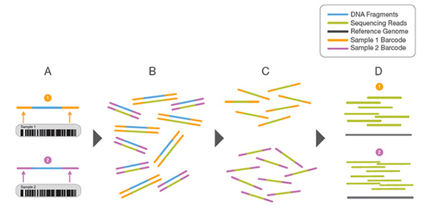

You will be assigned a set of barcodes to use for your samples. We have 12 barcodes available.

#### Community Standard

This is a DNA sample from a predefined "mock" microbial community, containing 8 species of bacteria and 2 yeast. The Bacteria are present at an abundance of 12% and the yeast are present at 2%. It is provided at 10ng/μl but we have diluted this to 1ng/μl for you.

https://www.zymoresearch.com/collections/zymobiomics-microbial-community-standards/products/zymobiomics-microbial-community-dna-standard

https://files.zymoresearch.com/datasheets/ds1706_zymobiomics_microbial_community_standards_data_sheet.pdf

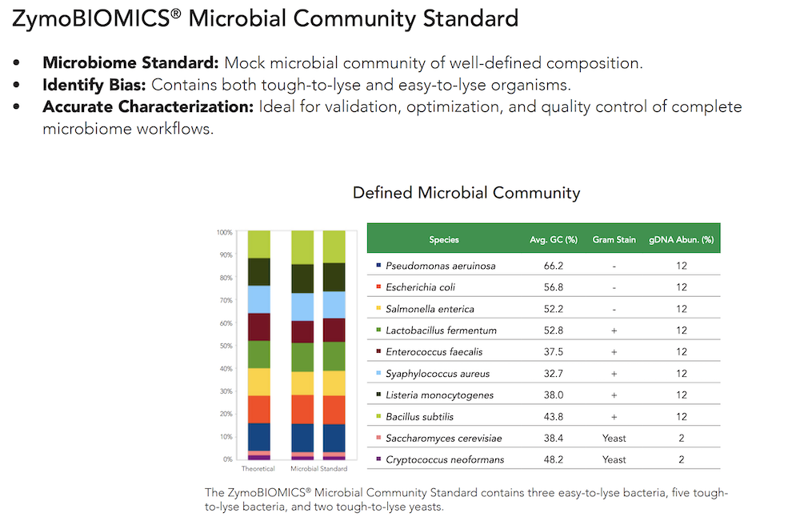

### <span style="color:purple">1. Check the DNA Concentration of Your Sample (Page 6)</span>

You can skip this if you have already checked using a Qubit high sensitivity assay or are just using the community standard (provided to you at 1ng/μl).

Please turn to page 6 of your handbook for the instructions. We will share a qubit flourometer and standards today.

### <span style="color:purple">2. Prepare you PCR reactions (Page 8)</span>

Please turn to page 8 of your handbook for the instructions.

*Remember the Community Standard is at 1ng/μl*

*Choose a different barcoded primer set for each sample!*

*Keep your reaction on ice, and we'll run them all together on the same PCR block*

The PCR block already has the program installed - called "16S"

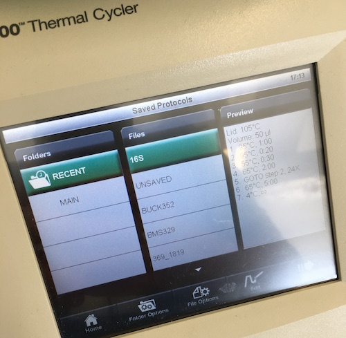

Once everyone has their samples ready we can select this program and hit go. We can now move on to the next part of the day.

------

# The sequencing Landscape

#### "2nd Generation sequencing"

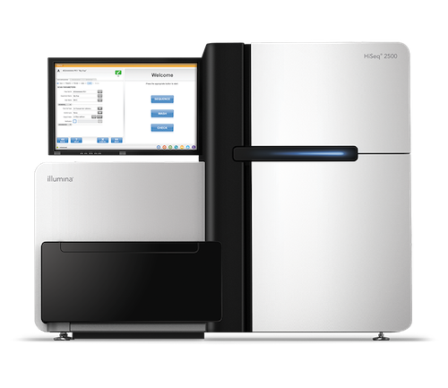

sequencing by synthesis is responsible for >98% of the worlds sequencing data, this is the technology behind Illumina sequencing.

* Short (paired) reads < 300bp
* No base modifications
* Data not available in real-time
* Capital costs high
* Cheap per base-pair
* Not portable
* Problems in highly repetitive regions (and mainly due to the issues of mapping short reads)
* Data is not outputted in real time

------

#### "3rd Generation Sequencing"

Two main players here:

* Pacfic Biosciences (PacBio)
* Oxford Nanopore Technologies

Both of these technologies provide reads longer than Illumina, by orders of magnitude.

Pacbio (SMRT sequencing), below, still relies on the emission of light and the measurement of this signal, so the sequencer itself has a large footprint and very expensive. What is interesting about SMRT sequencing is that it reads the same molecule of DNA multiple times. In this way PacBio can obtain reasonably high accuracy. Data is not outputted in real time.

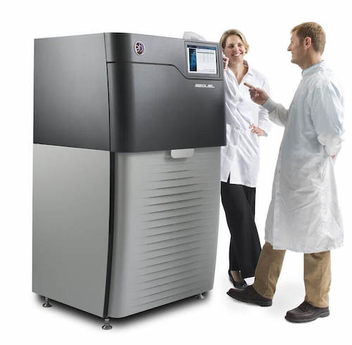

------

### Nanopore Sequencing Technology

https://www.youtube.com/watch?v=RcP85JHLmnI


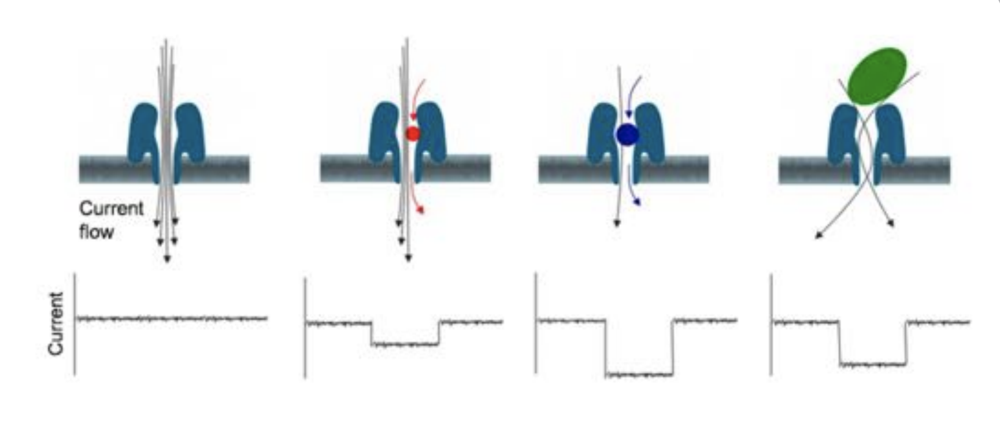

------

### Advantages of Nanopore Sequencing

* Long reads
* Assembly
* Sequencning of previously "dark" genomic regions
* Native DNA & RNA sequencing
* Base modification detectable at the same time as the identity of the base
* Portability
* Re-useable flow cells
* Real-time - "Run until".. you have enough data.

You do need a decent laptop or access to dencet commpute facilities to be able to do high accuracy basecalling.

------

#### Native DNA, Whole genomes etc

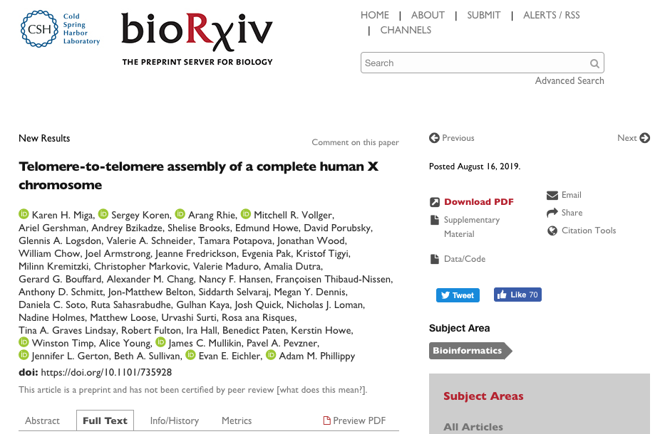

------

#### Targeting with CRISPR-CAS9

Standard capture techniques using probes are not really suitable for long-read platforms and so both pacbio and nanopore have developed CRISPR based approaches. The nice thing with this protocol is that DNA is native and so modifications are preserved.

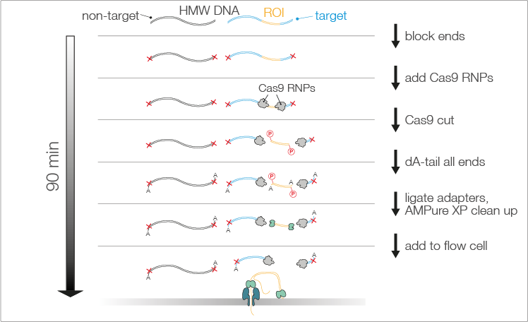

------

#### Base Modifications

One really nice advantage of nanopore technology is the simultaneous collection of not only the identity of the base being sequenced but any modifications that might also be present. Having the sequence and the modfication present from the same read can be very powerful.

For DNA methylation this is a relativley straightforward analysis process:

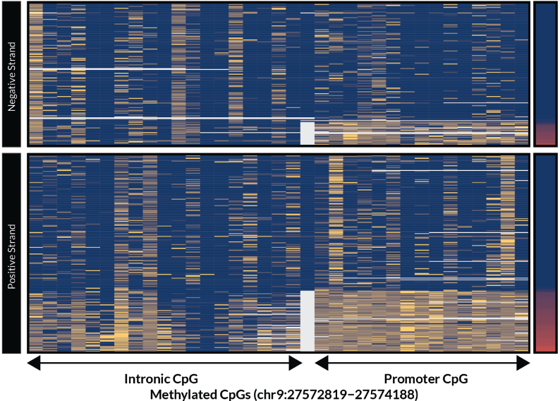

------

New applications are being developed continuously, usually these are not advances in the sequencing technology, but advances in the bioinformatics analysis. It's mostly a machine learning problem. Recently it has been shown that it is possible to detect modifications of RNA.

Here the authors have trained machine learning algorithms on synthetic modified and unmodified RNA.

"Accurate detection of m6A RNA modifications in native RNA sequences"
https://www.nature.com/articles/s41467-019-11713-9


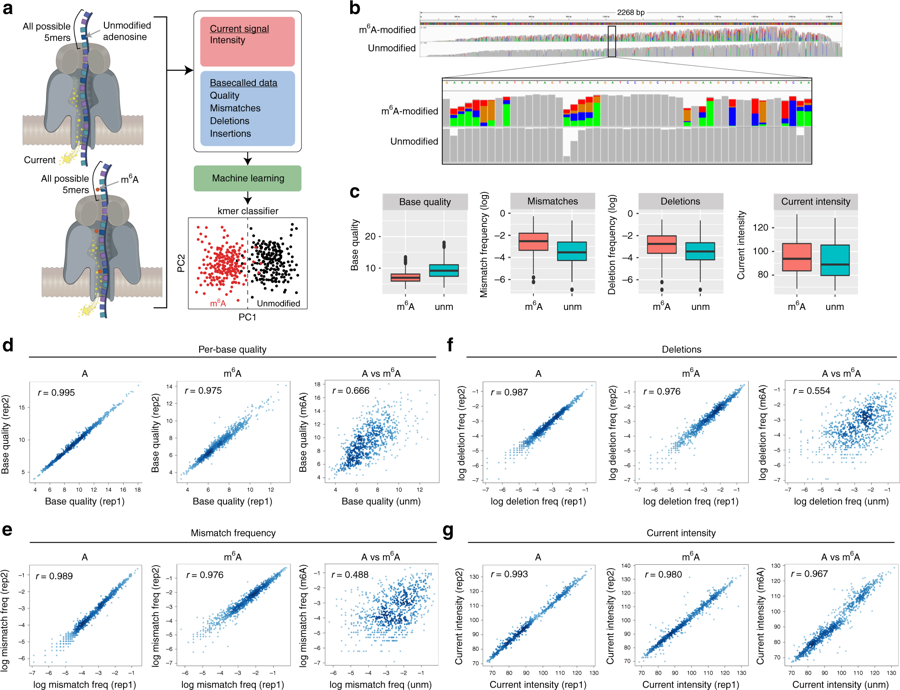


-----

#### Portable

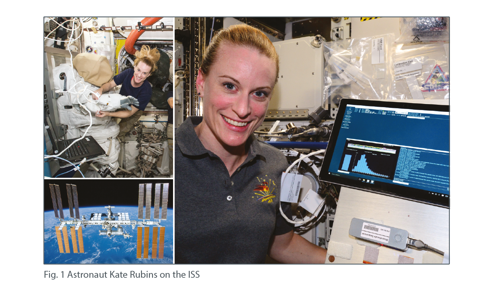

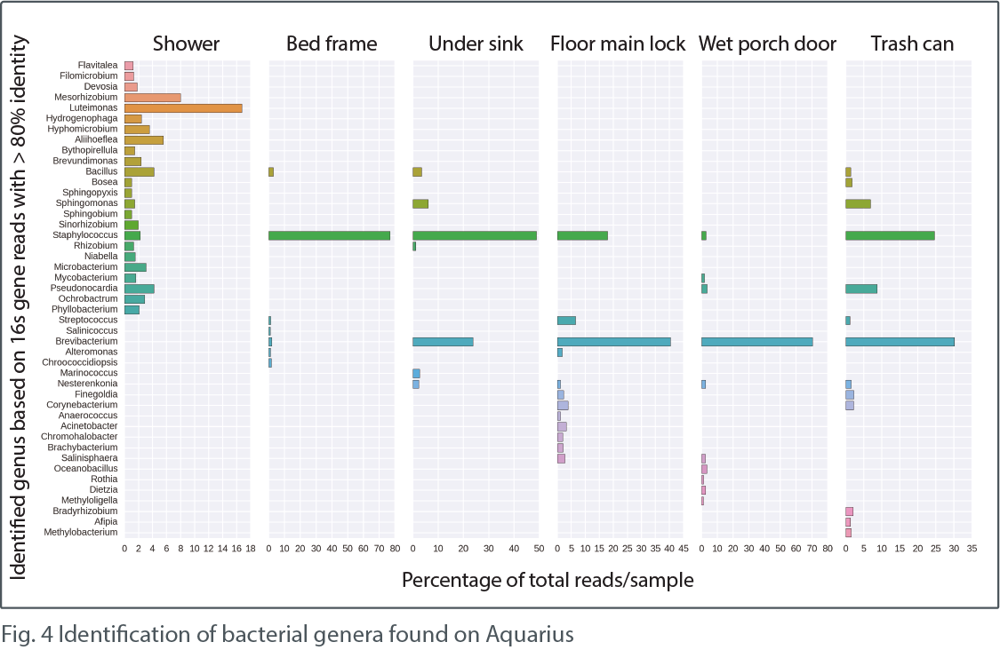


------

### Nanopore Sequencing Ecosystem

#### MinION

Great starter device, cheap, portable, still get loads of data - our best run = 13Gb - 7 Million reads.

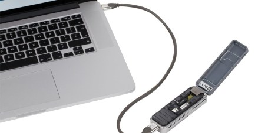

#### GridION

The GridION is basically an array of 5 MinIONs but with powerful compute built in.


#### MinION Flow Cells

2048 pores, available in R9.4 or the newer pore which is more accurate (R10). There are also flow cells which can sequence both strands.


#### Re-usable flow cells

Flow cells can be washed and used again. We've done this and been able to get just as much data on a second run. Using different barcodes is a way to ensure data is not mixed up.

Flow cells can also be "revived" with a nuclease flush.

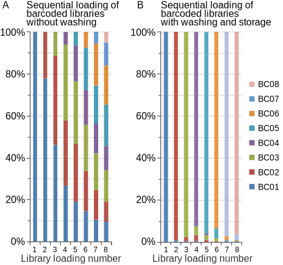

-----

#### Flongle

"Flongle is designed to be the quickest, most accessible and cost-efficient sequencing system for smaller tests and experiments." 126 channels rather than the MinION flow cells 512. (504 pores)

£72.50 per flow cell.

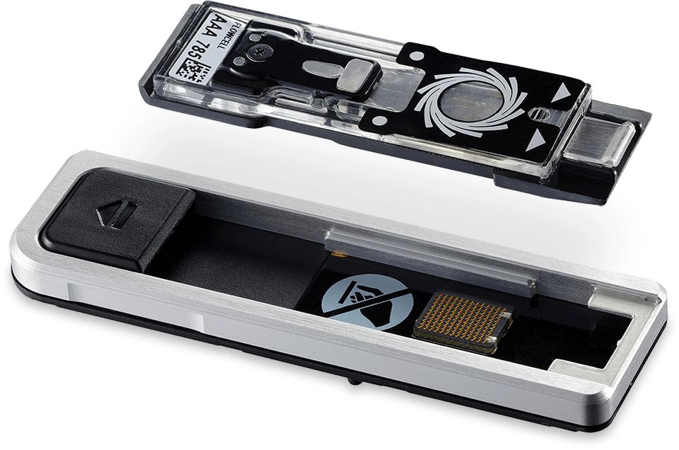


#### PrometheION

24 or 48 flow cells at a time (proprietary flow cells). > 7.3Tb on a 48 system (that's a 2000x human genome!!).

  

------

# 16S Sequencing 

16S rRNA sequencing has been popular in identifying bacterial species present in a sample:

1. Present in almost all bacteria
2. Function has not changed over time, random changes therefore a more accurate measure of time
3. Large enough for informatics purposes (1.5kb)
4. 16S rRNA Has hypervaribale regions that have diverged which are often flanked by conserved regions
5. Well characterised in lots of species
6. Good for broad community composition analysis

But...

1. You generally loose some measure of the diversity present and can lead to artifical increases in percieved diversity 
2. 16S is present in different copy numbers (you can attempt to correct for this) - For example E.coli has 7 copies

16S is more like a biological fingerprint.

**This course isn't intended to be a comprehensive argument on the metrits and issues of 16S sequecning, more an introduction to nanopore and data analysis.**

Today our aim is to PCR the bacterial 16S gene of any species present in your sample or the community we have provided. We will be using barcoded primers (27F and 1492R) provided by nanopore that result in a ~1.5kb fragment. Our resulting sequences will cover this whole fragment.

The main trust of this analysis is to determine what species are present in the sample.

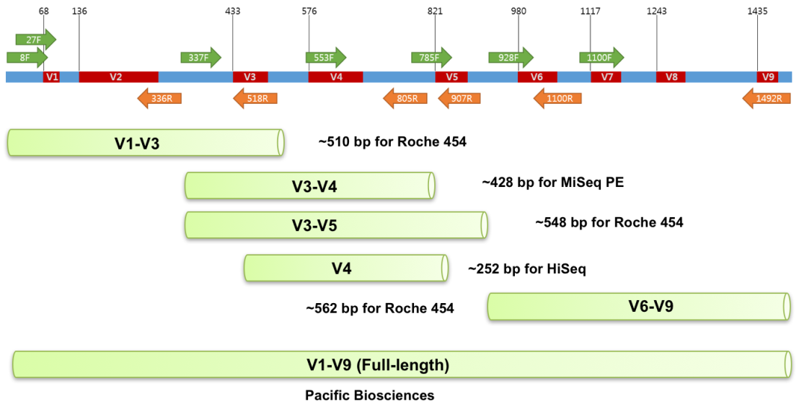


Primers:

| Primer | Sequence |
|--------|----------|
| 27F    | AGAGTTTGATCMTGGCTCAG |
| 1492R  | CGGTTACCTTGTTACGACTT |

It's important to not that no primer set is *truly* universal, and you may not amplify biologically relevant bacteria with this primer set. A number of sutidies include multiple sets of primers which ensure coverage of all species.

#### Variables that might affect your PCR

**1. Primer Sets**

* This publication uses different primer sets on a mock community control to compare their efficacy: https://bmcmicrobiol.biomedcentral.com/articles/10.1186/s12866-016-0738-z

* You could design your own primers, to aid in this we have included the layout of the nanopore 16S 27F priner below: 

```
5' - ATCGCCTACCGTGAC - <BARCODE> - AGAGTTTGATCMTGGCTCAG - 3'
```

**2. Polymerase**

It has been noted that using a high fidelity enzyme can improve species detection.

**3. Presence of PCR inhibitors**

This can come from a number or sources including debris from environmental samples and organic matter from fecal samples for instance.

**4. Number of Cycles**

Increasing cycles has been shown to increase the numbers of chimeras (see below) formed but there is an increase in the diversity of species detected when carrying out more PCR cycles.


#### Variables the Might Affect your Analysis

The goal is to be as accurate as possible

**1. Truncated Amplicons**

Short amplicons may cause false positive as there is more chance shorter sequences could match the reference database in multiple places

**2. Poor Quality Reads**

Poor quality reads may have errors which cause them to match the wrong reference sequence in the database.

**3. Chimeric Sequences**

Chimeric sequences are formed when the extension of an amplicon is aborted early. These aborted sequences act like primers and can potentially bind to a different species' 16S gene than they were formed from. This leads to an amplicon which contains the 16S sequence from two different species. These chimeric amplicons, after sequencing, could lead to species misidentification. There are tools to remove chimeric sequences.

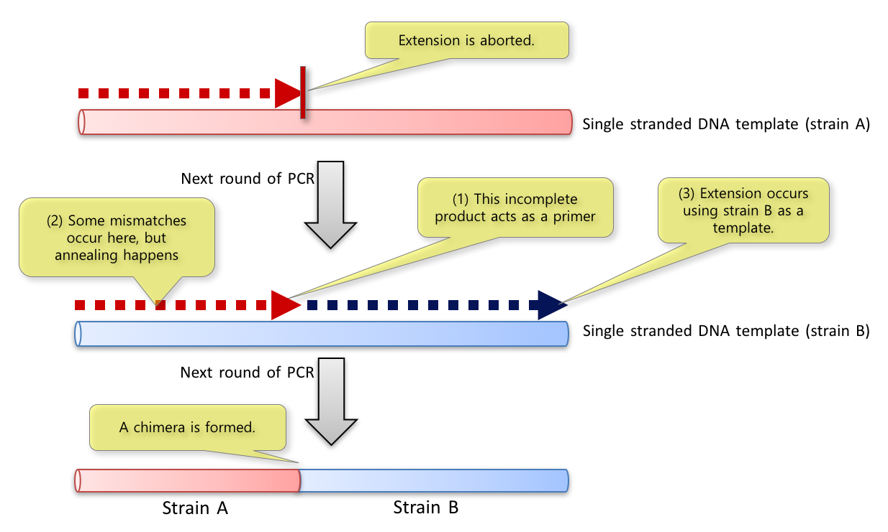

**4. Primer Regions**

Retaining primer regions has been shown to affect identity downstream.

**5. Reference Selection**

The reference you select could have an impact on the species you identify.


#### Controls

Reagents used during both the extraction and PCR/Sequencing could introduce contamination into your experiment. It has been shown that reagents contain contaminants that vary from batch to batch and from supplier to supplier. 

1. Extraction Control

2. PCR/sequencing Reagent control

It's is also difficult to know the correct way to deal with any detected contamination as a simple subtraction might result in the exclusion of bacteria that are indeed present in your test samples.


### Analysis


###  Operation Taxonomic Units (OTUs) - Groups or organisms that are closely related

Although this is standard in the community pre-nanopore, it might be that OTU picking is not the best approach for nanopore data! Because it's traditional we are going to go with it today, but otehr approaches might yield better results. 

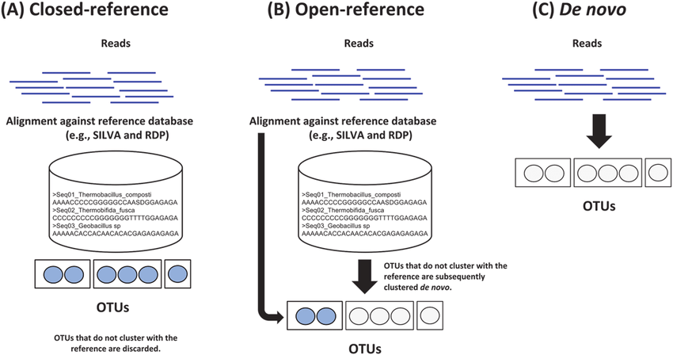


To Define OTUs:

1. Reference Based

>In a closed-reference OTU picking process, reads are clustered against a reference sequence collection and any reads which do not hit a sequence in the reference sequence collection are excluded from downstream analyses.

>In an open-reference OTU picking process, reads are clustered against a reference sequence collection and any reads which do not hit the reference sequence collection are subsequently clustered de novo.

2. *de novo*

In *de novo* OTU picking sequecnes are aligned against themselves to find a consensus that could constitute an OTU

* greater computational requirement


------

### 16S Sequencing Process

1. Lysis of cells in sample
2. PCR amplification
3. Attachment of sequencing adapters
4. sequencing & basecalling
5. Data analysis

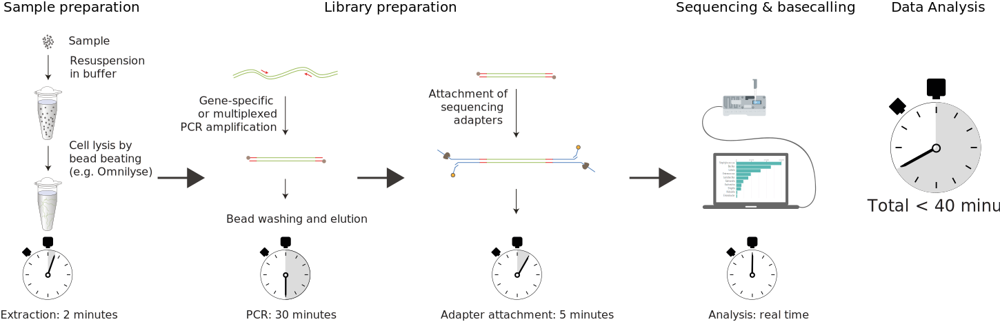
*One thing to get used to about nanopore sequencing, they always seem to suggest that it takes a lot less time than it actually does.*


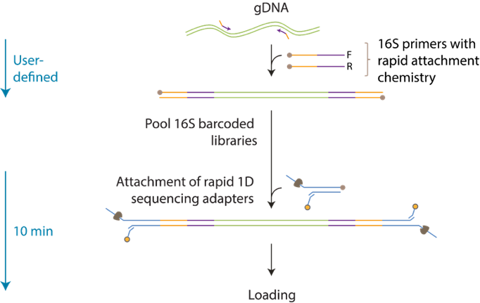


------

# Nanopore Sequencing Basics & Data Generation

In this section we will discuss how the Nanopore devices deliver data for analysis and the types of data generated by the nanopore sequencers.

Useful links:

* [Sequencing Chemistry](https://ont-repeat-resources.s3.eu-west-2.amazonaws.com/chemistry-technical-document-CHTD_500_v1_revR_07Jul2016.pdf)
* [MinKNOW Technical Document](https://ont-repeat-resources.s3.eu-west-2.amazonaws.com/minknow-tech-doc-MITD_5000_v1_revU_16May2016.pdf)
* [MinION & Flow Cells Document](https://ont-repeat-resources.s3.eu-west-2.amazonaws.com/hardware-HWTD_5000_v1_revK_03May2016.pdf)


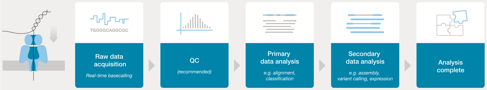


------

#### During Sequencing

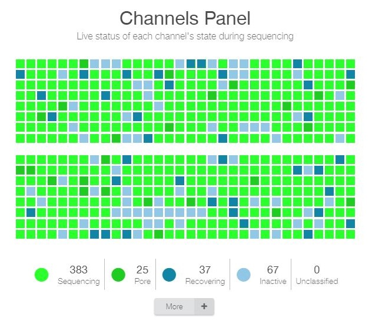

* **Sequencing** - a DNA strand translocating through a single pore
* **Pore** - a single open pore that is not currently capturing DNA
* **Recovering** - a single pore with a stalled DNA strand that is no longer translocating, or a current range that is too high to be meaningful
* **Inactive** - a channel that cannot be rescued and will no longer be able to sequence. Reasons can include the current being outside the detector limit, or the presence of multiple pores
* **Unclassified** - a channel that MinKNOW has not yet classified into one of the states described above

------

The Data is generated in two stages:

1. Raw signal data is recorded as the DNA passes through the pore. This data is often referred to as the **squiggle**.
2. This Raw Signal is converted into ATGC (and now base modifications) basecalls

These 2 processes happen asynchonously. On more powerful computers (or our GridION) the basecalling can keep up with production of sequencing reads, even in high accuracy mode.

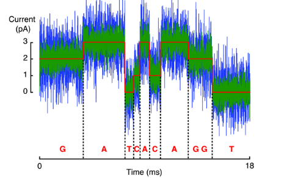

You can call bases, or even re-call bases with newer algorithms at a later date. The basecaller is often updated by nanopore and leaps are being made in terms of accuracy. They believe there is still headroom here for major improvements.

------

#### Structure of Data

The current version of MinKNOW outputs data into the folder you chose when you setup the sequncing run. It then makes a folder with you experiment name and then a folder for your sample. It is in this sample folder that you can find all of the data. This is the final structure of the folder once the run is complete, however **you can access the reads as soon as they are generated**.

```
/<DATA_DIR>/<EXPERIMENT>/<SAMPLE>:
  /fast5_fail
  /fast5_pass
  /fastq_fail
  /fastq_pass
  /sequencing_summary
  final_summary.txt
```

The sequencing files can be found in the fast5 and fastq directories. These are split between pass and fail. You are welcome to use the reads in the fail directory, however they are of lower quality. We use these reads in some instances.

------

### Common Sequencing Files

A number of files are common to all sequencing platforms, some are more proprietary. Nanopore introduced a new format, this was to allow storage of more information than could be stored in flat files efficiently. 

We will encounter most of these formats today

#### FASTA

* Plain text file
* Human readable
* Structured
* Just contains an ID and bases
• Common to find references in this format

Example:

```
>my_sequence
ATATATATTATATTATGCTGATGCTGATGCTGAT
>my_sequence_2
GGCGATGTATGCTGATGCTAGTGATGATAGTCGTAGTAGATGAT
```

#### FASTQ

* Plain text file
* Human readable
* Structured
• Contains an ID, DNA sequence and also quality information for that sequence

Example:

```
@SEQ_ID
GATTTGGGGTTCAAAGCAGTATCGATCAAATAGTAAATCCATTTGTTCAACTCACAGTTT
+
!''*((((***+))%%%++)(%%%%).1***-+*''))**55CCF>>>>>>CCCCCCC65
```

#### SAM/BAM

* Usually a file containing *mapped* reads
* Stores the read and quality information alongwith where the read maps to a reference genome
* SAM is human readable, but BAM is the compressed version

![images/sam_format.png)


We won't be going into too much detail here. You can find more details in some of our other course material here. http://sbc.shef.ac.uk/ngs-in-galaxy/

### Nanopore Specific Files

#### FAST5 (HDF5) (Single and Multi)

* Binary file format
* Not immediately human readable
* Structured - I.e. arranged like folders containing data
* Two types: Single, which contain a single sequencing read and Multi, containing muliple sequencing reads
* Contains the raw signal data from the pore, in addition to any base calling that might have occured

You can download a tool to view these files here:

https://www.hdfgroup.org/downloads/hdfview/

Please download and install!

Download this example multi-FAST5 file and we will explore this file together.

https://ont-repeat-resources.s3.eu-west-2.amazonaws.com/FAL21317_6db62ee48c2942f48abc8a31df023903feccbb72_8.fast5

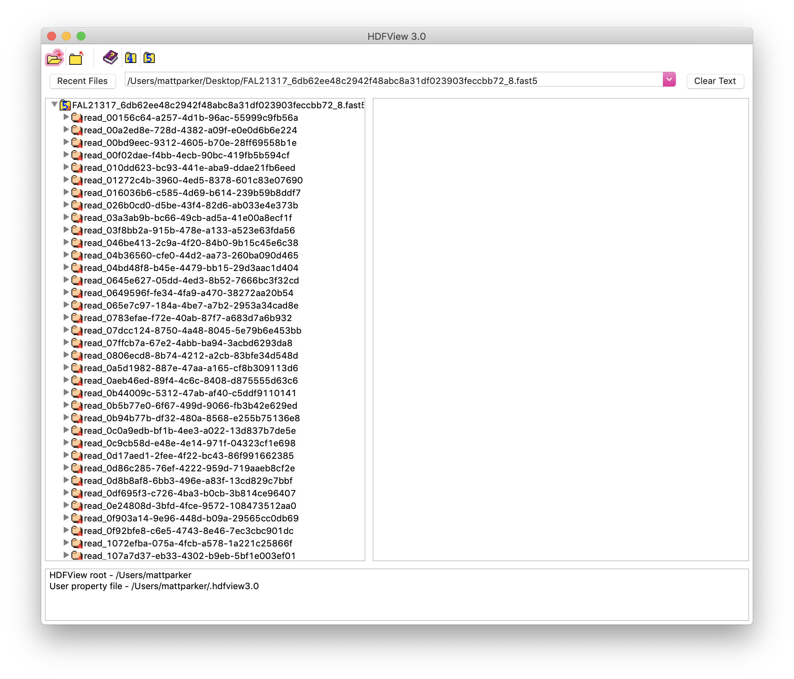

This is what a single FAST5 file is like (it just contains one read):

https://ont-repeat-resources.s3.eu-west-2.amazonaws.com/0__mreads_file0.fast5

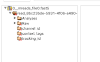

You very rarely need to look directly at the data in the FAST5 files.

------

# Today's Experiment (Part 2)

Let's get back to the experiment.

### <span style="color:purple">3. Bead Clean-up of PCR (Page 10)</span>

------

### <span style="color:purple">4. Check Hardware (Page 11)</span>

------


### <span style="color:purple">5. Check Flowcell (Page 12)</span>

------

### <span style="color:purple">6. Prepare Flow Cell (Page 13)</span>

I have reporduced the figure from the handbook here for reference.

There are 3 ports of interest on the flow cell:

* The sample port - sample loading port
* Priming port - to remove storage buffer and replace with flow cell priming buffer
* Waste port - for removal of waste

We are going to watch this video which shows the whole process: https://www.youtube.com/watch?v=CC11Jlydqrc


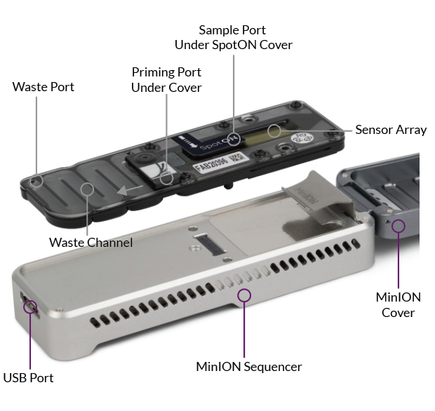

Page 9 of your handbook takes you through the steps required to prepare the flow cell for loading your library.

------

### <span style="color:purple">7. Pool & Load Library (Page 14)</span>

------

### <span style="color:purple">8. Sequence Sample (Page 16)</span>

------

# Data processing

## Cluster Login

To carry out the bioinformatcis analysis we'll logon to the university high performance computer (HPC) cluster. The university has provided us with 2 nodes of the HPC to run the course on today. 

The learning curve here is going to be **steep** but we'll get there.

1. You need to open a terminal client:

&nbsp;&nbsp;&nbsp;&nbsp;&nbsp;&nbsp;&nbsp;&nbsp;&nbsp;&nbsp;a. If you are on windows - download putty - a client that will allow us to access the cluster.
&nbsp;&nbsp;&nbsp;&nbsp;&nbsp;&nbsp;&nbsp;&nbsp;&nbsp;&nbsp;&nbsp;&nbsp;&nbsp;https://the.earth.li/~sgtatham/putty/latest/w64/putty-64bit-0.72-installer.msi

&nbsp;&nbsp;&nbsp;&nbsp;&nbsp;&nbsp;&nbsp;&nbsp;&nbsp;&nbsp;b. If you are using a mac you can just open `terminal` - search for this using the magnifying glass

2. Open putty and type `ssh <USERNAME>@sharc.shef.ac.uk`
3. Enter your password

You are now on the **head node**, this is purely a computer for accessing the cluster and doing very basic low level tasks. 

Some very basic unix commands:

| Command | Description |
|---|---|
|`pwd`|Prints current working directory|
|`ls`|Lists contentx of current directory|
|`ls ..`|lists contents of parent directory|
|`ls /some/path`|lists contents of /some/path|
|`cd /some/path`|Change directory to /some/path|
|`mkdir somedir`|Create a directory "somedir" in your current working directory|
|`nano some.file`|Opens a texteditor for some.file|
|`cat one.file two.file three.file`|Concatenates one.file, two.file and three.file|
|`cat one.file two.file three.file > new.file`|Concatenates one.file, two.file and three.file into a new file|

To do computation and analyses we need to logon to a **compute node**

The following command requests 20G and 2 threads on a compute node on our special queue in an interactive way (i.e. you can type commands)

```
qrsh -l h_vmem=10G -P neurosci-course -q neurosci-course.q -pe smp 2
```

Now change directory:

```
cd /fastdata/<USERNAME>
```

And make a directory:

```
mkdir nanopore_course
```

You also need a tmp directory where qiime stores some files it need and we need to set another variable to make qiime2 work

```
mkdir tmp
```

I have created a singularity image which contains all of the software you need today. A singulairty image is like a virtual machine, like running windows on a mac or something like that.

To start the image where we will carry out all of our analysis execute the following command:

```
singularity shell --bind /fastdata/<USERNAME>:/fastdata/<USERNAME> --contain /shared/bioinformatics_core1/Shared/training/nanopore_course-v1.0.2sept2019.img
```

We just need to do a little configuration

```
export TMPDIR=/fastdata/<USERNAME>/tmp
export HDF5_USE_FILE_LOCKING='FALSE'
conda init bash 
source .bashrc
conda activate qiime2-2019.7 

cd /fastdata/<USERNAME>/nanopore_course

```

The last step is to access the storage on the cluster from your machine. We can mount this on your laptop.

**Mac:**

`Finder > Go > Connect to Server` enter "smb://uosfstore.shef.ac.uk/shared/" and then "Connect" and enter your username and password

**Windows:** 

`Explorer > Right Click "This PC" > Add network location > Choose a custom network location` //uosfstore.shef.ac.uk/shared/, now click through.

(https://www.techrepublic.com/article/how-to-connect-to-linux-samba-shares-from-windows-10/)

Ok so now we are ready to go with our analysis.

-----

## Pipeline

Initially we will use some community data we generated a couple of weeks ago:

| Barcode | Sample |
|---------|-------|
| 1 | 1ng of DNA into PCR |
| 3 | 5ng of DNA into PCR |
| 4 | 10ng of DNA into PCR |

You can find the data in `/data`

This data was called on the "fast" basecalling pipeline. It will be improved dramatically be re-calling on the high accuracy base-caller. We are also only starting our analysis with 44,000 reads - it is likely using more reads will improve composition of our community, but may also introduce more false positives.

if you do:

```
ls /data
```

You will see the fastq and fast5 directories we will be using.

There are 3 main steps to the data analysis we will do today (our pipeline):

1. QC
2. Demultiplexing
3. 16S Anlysis in Qiime2

------

### 1. QC

------

We are going to QC this run using PycoQC which produces a html report on various run statistics.

Nanopore software outputs a sequencing summary file which is used in this analysis. Here I have provided you with a subset of the data to make runtime faster.

```
pycoQC \
  -f /data/community/sequencing_summary.txt \
  -o pycoQC_output.html
```

pycoQC will create a html file we can view in a browser. This will give us some of the plot you saw when sequecning but also some more useful stuff too.

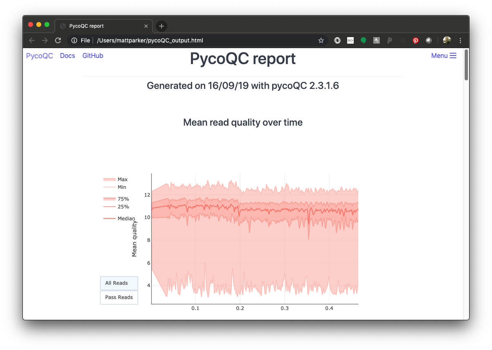

------

### 2. Pre-Processing

------

#### 1. Concatenate all of the fastq files together

This command concatenates files together. The `*` is a wildcard, meaning it will get is all of the .fastq files, regardless of their name. `>` means redirect to somewhere, in this case we are redirecting the output to a file called `all.fastq`

```
cat /data/community/fastq/*.fastq > all.fastq
```

#### 2. Demultiplex & Trim Adapters & Primers


We are using a version of porechop I have modified to know the sequnce of our 16S primers and trim them too!

Demultiplexed files will be stored in `demux/`

We are discarding any reads where adapters are found in the middle.

```
/software/Porechop/porechop-runner.py \
  -i all.fastq \
  -b demux \
  --discard_middle
```

Porechop should be able to find reads from 3 barcodes; 1,3 and 4.

(Files in case this doesn't work:

BC01 - https://nanopore-course-resources.s3.us-east-2.amazonaws.com/analysis/BC01.fastq

BC03 -  https://nanopore-course-resources.s3.us-east-2.amazonaws.com/analysis/BC03.fastq

BC04 - https://nanopore-course-resources.s3.us-east-2.amazonaws.com/analysis/BC04.fastq)


#### 2. Filter Short Reads & Low Qaulity

Now we have barcode, adapter and primer trimmed reads we can filter on length and quality.

Here we are using a *for loop* for each of BC01, BC03 and BC04 assign to `$barcode` and execute the command.

```
cd demux

for barcode in BC01 BC03 BC04; \
  do /software/Filtlong/bin/filtlong \
    --assembly /reference/99_otus.fasta \
    --min_length 1400 \
    --trim \
    --window_size 50 \
    --keep_percent 90 \
    ${barcode}.fastq > ${barcode}_filtlong_50_window.fastq; \
done
```
(Files in case this doesn't work:

BC01 - https://nanopore-course-resources.s3.us-east-2.amazonaws.com/analysis/BC01_filtlong_50_window.fastq

BC03 -  https://nanopore-course-resources.s3.us-east-2.amazonaws.com/analysis/BC03_filtlong_50_window.fastq

BC04 - https://nanopore-course-resources.s3.us-east-2.amazonaws.com/analysis/BC04_filtlong_50_window.fastq)

We now have reads ready for analysis.

------

### 3. 16S Analysis with Qiime2

------

#### Pre-Amble

Qiime requires that you import data into it's own format. I have done this for you with the 99 OTU green genes database. This might not be the best out there but it serves the purpose for our demonstration.

FYI I have included the commands here:

##### Get Data
```
wget ftp://greengenes.microbio.me/greengenes_release/gg_13_5/gg_13_8_otus.tar.gz
```
##### Unzip
```
tar -xvf gg_13_8_otus.tar.gz
```
##### Import sequence file
```
qiime tools import --input-path gg_13_8_otus/rep_set/99_otus.fasta --output-path 99_otus.qza --type 'FeatureData[Sequence]'
```
##### Import taxonomy file
```
qiime tools import --input-path gg_13_8_otus/taxonomy/99_otu_taxonomy.txt --output-path 99_otu_taxonomy.qza --type FeatureData[Taxonomy] --input-format HeaderlessTSVTaxonomyFormat
```

------

#### 1. Load data

We 1st need to load our data into Qiime. 

We need a sample manifest file, this contains two columns, your sample ID and the path to the fastq file containing reads from that sample (This is your porechop output).

To make a new file open the editor `nano`

```
nano manifest
```

Copy and paste this into nano **(make sure spaces are replaced by a tab!)**:

```
sample-id	absolute-filepath
ONE_NG	/fastdata/md1mpar/nanopore_course/demux/BC01_filtlong_50_window.fastq
FIVE_NG	/fastdata/md1mpar/nanopore_course/demux/BC03_filtlong_50_window.fastq
TEN_NG	/fastdata/md1mpar/nanopore_course/demux/BC04_filtlong_50_window.fastq
```

*you could include both the demultiplexed only and the demultiplexed and trimmed reads in this manifest to examine the effect of the quality control we have applied*

Now close nano. Press the following:

* `ctrl+x` 
* `y` you want to save changes
* press enter again save changes to the filename `manifest`

Now we have a manifest we can import.

```
qiime tools import \
  --type 'SampleData[SequencesWithQuality]' \
  --input-path manifest \
  --output-path community_raw_sequences.qza \
  --input-format SingleEndFastqManifestPhred33V2
```

Example file - https://nanopore-course-resources.s3.us-east-2.amazonaws.com/analysis/community_raw_sequences.qza

#### 2. De-Replicate Sequences

1. compare all the sequences in a data set to each other
2. group similar sequences together
3. output a representative sequence from each group. In this way, duplicate sequences are removed from a library.

```
qiime vsearch dereplicate-sequences \
  --i-sequences community_raw_sequences.qza \
  --o-dereplicated-table community_raw_sequences_dereplicated_table.qza \
  --o-dereplicated-sequences community_raw_sequences_dereplicated_seqs.qza \
  --verbose
```

Example files:

Sequences: https://nanopore-course-resources.s3.us-east-2.amazonaws.com/analysis/community_raw_sequences_dereplicated_seqs.qza

Table: https://nanopore-course-resources.s3.us-east-2.amazonaws.com/analysis/community_raw_sequences_dereplicated_table.qza


#### 3. Cluster Sequecnes into OTUs

We are doing closed-reference clustering. Remember this is where we use a reference to compare our sequences to. If a matching sequence can't be found in the database then the read is discarded.

```
qiime vsearch cluster-features-closed-reference \
  --i-table community_raw_sequences_dereplicated_table.qza \
  --i-sequences community_raw_sequences_dereplicated_seqs.qza \
  --i-reference-sequences /reference/99_otus.qza \
  --p-perc-identity 0.85 \
  --o-clustered-table community_raw_sequences_dereplicated-cr-99_table.qza \
  --o-clustered-sequences community_raw_sequences_dereplicated-cr-99_seqs.qza \
  --o-unmatched-sequences community_raw_sequences_dereplicated-cr-99_unmatched.qza \
  --verbose

```

Example files:

Sequences: https://nanopore-course-resources.s3.us-east-2.amazonaws.com/analysis/community_raw_sequences_dereplicated-cr-99_seqs.qza

Table: https://nanopore-course-resources.s3.us-east-2.amazonaws.com/analysis/community_raw_sequences_dereplicated-cr-99_table.qza


#### 4. Remove Chimera

First we find chimeras using a de-novo chimera detection algorithm (https://www.biorxiv.org/content/10.1101/074252v1)

```
qiime vsearch uchime-denovo \
  --i-table community_raw_sequences_dereplicated-cr-99_table.qza \
  --i-sequences community_raw_sequences_dereplicated-cr-99_seqs.qza \
  --output-dir uchime-dn-out
```

Example files: 

https://nanopore-course-resources.s3.us-east-2.amazonaws.com/analysis/chimeras.qza

https://nanopore-course-resources.s3.us-east-2.amazonaws.com/analysis/nonchimeras.qza

https://nanopore-course-resources.s3.us-east-2.amazonaws.com/analysis/stats.qza


Now we filter these out

```
qiime feature-table filter-features \
  --i-table community_raw_sequences_dereplicated-cr-99_table.qza \
  --m-metadata-file uchime-dn-out/nonchimeras.qza \
  --o-filtered-table uchime-dn-out/table-nonchimeric-wo-borderline.qza
  
qiime feature-table filter-seqs \
  --i-data community_raw_sequences_dereplicated-cr-99_seqs.qza \
  --m-metadata-file uchime-dn-out/nonchimeras.qza \
  --o-filtered-data uchime-dn-out/rep-seqs-nonchimeric-wo-borderline.qza
  
qiime feature-table summarize \
  --i-table community_raw_sequences_dereplicated-cr-99_table.qza \
  --o-visualization uchime-dn-out/table-nonchimeric-wo-borderline.qzv  

```

Example Files:

https://nanopore-course-resources.s3.us-east-2.amazonaws.com/analysis/rep-seqs-nonchimeric-wo-borderline.qza

https://nanopore-course-resources.s3.us-east-2.amazonaws.com/analysis/table-nonchimeric-wo-borderline.qza

https://nanopore-course-resources.s3.us-east-2.amazonaws.com/analysis/table-nonchimeric-wo-borderline.qzv


Because we have already assigned taxonomy to our OTUs we don't need to do any further classification so we can now plot the data.

#### 5. Plot Data

Qiime will make an interactive barplot of our clustered OTUs.

```
qiime taxa barplot \
  --i-table uchime-dn-out/table-nonchimeric-wo-borderline.qza \
  --i-taxonomy /reference/99_otu_taxonomy.qza \
  --o-visualization uchime-dn-out/table-nonchimeric-wo-borderline_barplot \
  --m-metadata-file manifest
```

Example File:
https://nanopore-course-resources.s3.us-east-2.amazonaws.com/analysis/table-nonchimeric-wo-borderline_barplot.qzv

You can drag qiime files into this interface:

https://view.qiime2.org/

or you can export the data into a html file. 

```
qiime tools export \
  --input-path uchime-dn-out/table-nonchimeric-wo-borderline_barplot.qza \
  --output-path uchime-dn-out/barplot
```


#### 6. Dealing with your blanks

For the small dataset here there were no reads in our blank. It's possible that analysing the full dataset we would have some reads in here that might tell us about the reagent mircobiome contribution to our samples. This is especially important if your sample is not rich in bacteria or you have very low input DNA.

The bioinformatic handling of blank data is tricky, because you can't immediately remove the species found in you blank from your test samples, you may remove species that should be present in your sample. 

http://ccb.jhu.edu/people/salzberg/BME689/Readings/Salter-etal-BMCBiology2014.pdf

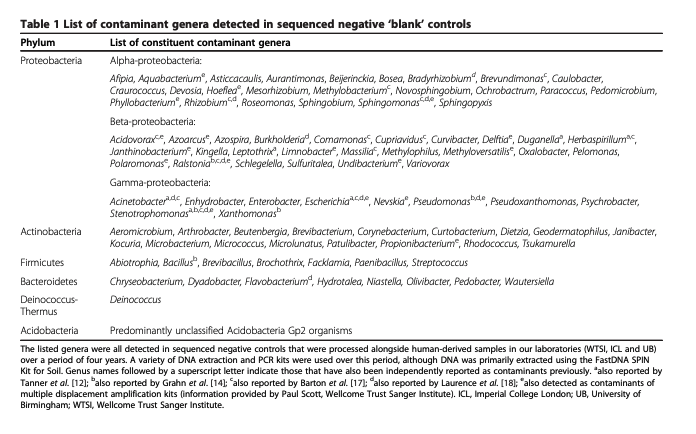

There are tools out there to deal with blanks: https://onlinelibrary.wiley.com/doi/full/10.1002/edn3.1


------

### Summary

There are many ongoing discussions in the literature about how to handle 16S analysis for nanopore data, and this tutorial is by no means either comprehensive or completely best practice, but is intended to give only a flavour of what's possible in an afternoon.

* 16S sequecning provides a broad overview of what bacteria are present in your sample
* Be aware of issues like chimeras when anaylsing 16S data
* Clustering reads into Operational Taxonomic Units is the most popular way to carry out 16S analysis
* Filtering steps/databases you employ can really affect you results

------

### Today's Run

We can follow the same pipeline with the run in progress.

#### 1. Transfer Some Data

We 1st need to transfer some data from the laptops running the sequencing.

1. On your laptop make the directory `mkdir /fastdata/<USERNAME>/nanopore_course/todays_data`
2. Change to that directory `cd /fastdata/<USERNAME>/nanopore_course/todays_data`
3. On the laptop running sequecning open terminal. Click the 1st button: "Search your computer" in the launcher on the left of the screen.
4. Type "terminal" and press enter.
5. Type the following: `rsync -Pr <DATA_LOCATION>/fastq_pass/*.fastq  <USER_NAME>@sharc.shef.ac.uk:/fastdata/<USERNAME>/nanopore_course/todays_data/`
6. Enter your password for ShARC and data transger should begin.

#### 2. Follow Steps Above

Next you need to (see above):

1. `cat` fastq file together
2. Demultiplex & remove primers
3. Filter
4. Call OTUs
5. Filter chimeras
6. Create barplot

--------

### Extra Excercises

Qiime2 docs can be found here:

https://docs.qiime2.org/2019.7/

---------

#### You could filter low abundance features.

------

#### You could try chimera detection using a reference **tip: this probably produces a cleaner result**:

```
qiime vsearch uchime-ref \
  --i-table community_raw_sequences_dereplicated-cr-99_table.qza \
  --i-sequences community_raw_sequences_dereplicated-cr-99_seqs.qza \
  --i-reference-sequences /reference/99_otus.qza \
  --output-dir uchime-ref-out \
  --verbose

```

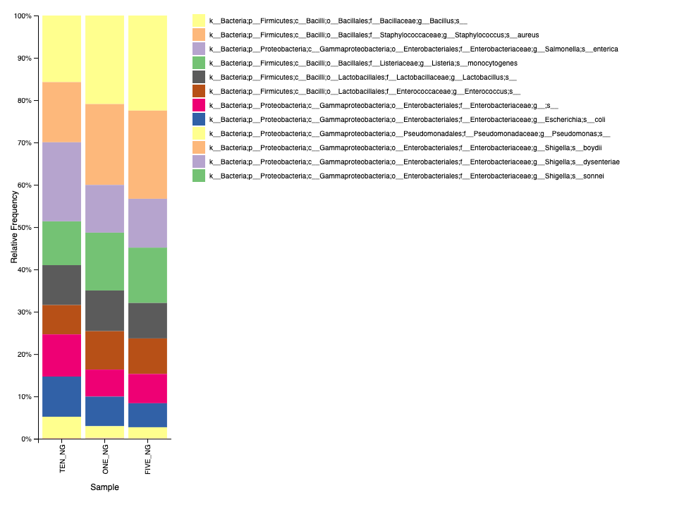

You will need to filter again:

```
qiime feature-table filter-features \
  --i-table community_raw_sequences_dereplicated-cr-99_table.qza \
  --m-metadata-file uchime-ref-out/nonchimeras.qza \
  --o-filtered-table uchime-ref-out/table-nonchimeric-wo-borderline.qza
  
qiime feature-table filter-seqs \
  --i-data community_raw_sequences_dereplicated-cr-99_seqs.qza \
  --m-metadata-file uchime-ref-out/nonchimeras.qza \
  --o-filtered-data uchime-ref-out/rep-seqs-nonchimeric-wo-borderline.qza
  
qiime feature-table summarize \
  --i-table community_raw_sequences_dereplicated-cr-99_table.qza \
  --o-visualization uchime-ref-out/table-nonchimeric-wo-borderline.qzv  
```

------

#### You could try with the SILVA database:

```
cd /reference
wget https://www.arb-silva.de/fileadmin/silva_databases/qiime/Silva_132_release.zip
unzip Silva_132_release.zip
```

This is the files you need (I think!):
`/reference/SILVA_132_QIIME_release/rep_set/rep_set_16S_only/99/silva_132_99_16S.fna`
`/reference/SILVA_132_QIIME_release/taxonomy/16S_only/99/majority_taxonomy_7_levels.txt`

You need to import this 1st:

```
cd /reference 

qiime tools import --input-path SILVA_132_QIIME_release/rep_set/rep_set_16S_only/99/silva_132_99_16S.fna --output-path silva_132_99_16S.qza --type 'FeatureData[Sequence]'

qiime tools import --input-path SILVA_132_QIIME_release/taxonomy/16S_only/99/majority_taxonomy_7_levels.txt --output-path silva_132_99_16S_taxonomy.qza --type FeatureData[Taxonomy] --input-format HeaderlessTSVTaxonomyFormat
```

------

#### You could try more accurate basecalled data - use these fastq files instead!

```
wget https://nanopore-course-resources.s3.us-east-2.amazonaws.com/community_hac/fastq_runid_ff8e20b585bc751b27b2278f7346b51eb7bb2b8c_0.fastq
wget https://nanopore-course-resources.s3.us-east-2.amazonaws.com/community_hac/fastq_runid_ff8e20b585bc751b27b2278f7346b51eb7bb2b8c_1.fastq
wget https://nanopore-course-resources.s3.us-east-2.amazonaws.com/community_hac/fastq_runid_ff8e20b585bc751b27b2278f7346b51eb7bb2b8c_2.fastq
wget https://nanopore-course-resources.s3.us-east-2.amazonaws.com/community_hac/fastq_runid_ff8e20b585bc751b27b2278f7346b51eb7bb2b8c_3.fastq
wget https://nanopore-course-resources.s3.us-east-2.amazonaws.com/community_hac/fastq_runid_ff8e20b585bc751b27b2278f7346b51eb7bb2b8c_4.fastq
wget https://nanopore-course-resources.s3.us-east-2.amazonaws.com/community_hac/fastq_runid_ff8e20b585bc751b27b2278f7346b51eb7bb2b8c_5.fastq
wget https://nanopore-course-resources.s3.us-east-2.amazonaws.com/community_hac/fastq_runid_ff8e20b585bc751b27b2278f7346b51eb7bb2b8c_6.fastq
wget https://nanopore-course-resources.s3.us-east-2.amazonaws.com/community_hac/fastq_runid_ff8e20b585bc751b27b2278f7346b51eb7bb2b8c_7.fastq
wget https://nanopore-course-resources.s3.us-east-2.amazonaws.com/community_hac/fastq_runid_ff8e20b585bc751b27b2278f7346b51eb7bb2b8c_8.fastq
wget https://nanopore-course-resources.s3.us-east-2.amazonaws.com/community_hac/fastq_runid_ff8e20b585bc751b27b2278f7346b51eb7bb2b8c_9.fastq
wget https://nanopore-course-resources.s3.us-east-2.amazonaws.com/community_hac/fastq_runid_ff8e20b585bc751b27b2278f7346b51eb7bb2b8c_10.fastq
```

------

#### You could try Denovo clustering & feature selection:

```
qiime vsearch cluster-features-de-novo \
  --i-sequences ../community_raw_sequences_dereplicated_seqs.qza \
  --i-table ../community_raw_sequences_dereplicated_table.qza \
  --p-threads 12 \
  --o-clustered-table  community_raw_sequences_dereplicated_denovo_table.qza \
  --o-clustered-sequences community_raw_sequences_dereplicated_denovo_seq.qza \
  --p-perc-identity 0.85
```

On my laptop this next step took to long so I did blast instead

```
qiime feature-classifier classify-consensus-vsearch \
  --i-query community_raw_sequences_dereplicated_denovo_seq.qza \
  --i-reference-reads /reference/99_otus.qza \
  --i-reference-taxonomy /reference/99_otu_taxonomy.qza \
  --o-classification community_raw_sequences_dereplicated_denovo_seq_tax.qza \
  --p-threads 12
```

Blast version:

```
qiime feature-classifier classify-consensus-blast \
    --i-query community_raw_sequences_dereplicated_denovo_seq.qza \
    --i-reference-reads /reference/99_otus.qza \
    --i-reference-taxonomy /reference/99_otu_taxonomy.qza \
    --o-classification community_raw_sequences_dereplicated_denovo_seq_tax.qza \
    --verbose
```

I then created the barplot as above.

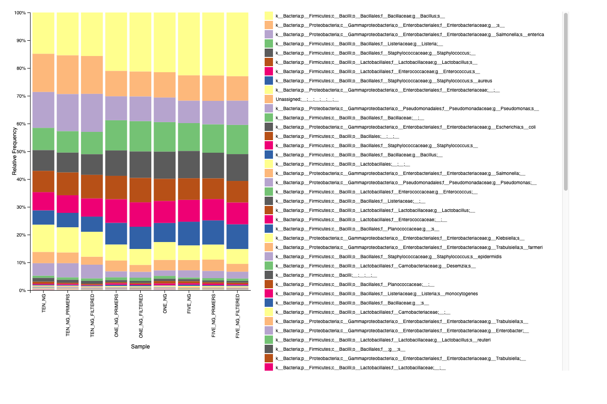

--------

### Feedback

Please leave us some feedback to help us understand what worked well and what might help us improve the course in the future...

https://docs.google.com/forms/d/e/1FAIpQLSelSM6jSMKTqK1bD8HG1E0hRqO8_X1CXDYSCG-HjGnA-MEw-Q/viewform?usp=sf_link


Interesting pipeline: https://github.com/aramette/LORCAN (https://www.biorxiv.org/content/10.1101/752774v1)

Great thread on 16S analysis pipelines
https://community.nanoporetech.com/posts/16s-rrna-amplicon-nanopore

