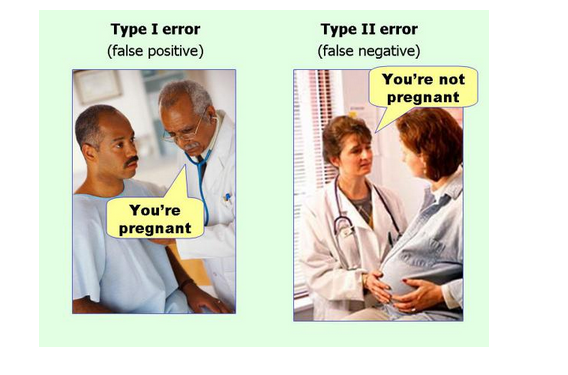

```{r setup, include=FALSE}
knitr::opts_chunk$set(comment = NA,echo=FALSE,message=FALSE,warning = FALSE,fig.height=6)
```

# Introduction

## Overview

- What is statistics? Why do we need it?
- Understanding data types
- Worked examples and exercises of various forms of "t-test"
    + using online tools

## The point of statistics

- Rarely feasible to study the whole population that we are interested in, so we take a sample instead
- Assume that data collected represents a larger population
- Use sample data to make conclusions about the overall population


## Beginning a study

- Which samples to include?
    + Randomly selected?
    + Generalisability
- Always think about the statistical analysis
    + Randomised comparisons, or biased?
    + Any dependency between measurements?
    + Data type?
    + Distribution of data?  (Normally distributed? Skewed? Bimodal?...)
    
## Generalisability

- How samples are selected affects interpretation
    + What is the population that the results apply to?
    + How widely applicable will the study be?
- Statistical methods assume random samples
- Do not extrapolate beyond range of the data
    + i.e. don’t assume results apply to anything not represented in the data
- Examples: 
    + Males only, no idea about females
    + Adults only, no idea about children
    + 1 litter of mice, no idea about other litters

## Data types

- Several different categorisations
- Simplest:
    + Categorical (nominal) 
    + Categorical with ordering (ordinal)
    + Discrete
    + Continuous

## Nominal

- Most basic type of data
- Three requirements:
    + Same value assigned to all the members of level
    + Same number not assigned to different levels
    + Each observation only assigned to one level
- Boils down to yes/no answer
- e.g. Surgery type, smoker / non-smoker, eye colour, dead/alive, ethnicity.

## 


- Mutually exclusive fixed categories
- Implicit order
- Can say one category higher than another
    + But not how much higher
- Example: stress level 1 = low … 7 = high
- Others: Grade, stage, treatment response, education level, pain level.

## Discrete


- Fixed categories, can only take certain values
- Like ordinal but with well-defined distances
    + Can be treated as continuous if range is large
- Anything counted (cardinal) is discrete 
    + *how many*?
- Examples: number of tumours, shoe size, hospital admissions, number of side effects, medication dose, CD4 count, viral load, reads.

## Continuous


- Final type of data
- Anything that is measured, can take any value
- May have finite or infinite range
- Zero may be meaningful: ratios, differences
    + Care required with interpretation
- Given any two observations, one fits between
- Examples: Height, weight, blood pressure, temperature, operation time, blood loss, age.

## Data types

- Several different categorisations
- Simplest:
    + Categorical (nominal) – yes/no
    + Categorical with ordering (ordinal) – implicit order
    + Discrete – only takes certain values; counts (cardinal) 
    + Continuous – measurements; finite/infinite range
    
## Measurements: Dependent / Independent?

- Measurements of gene expression taken from each of 20 individuals
- Are any measurements more closely related than others?
    + Siblings/littermates? 
    + Same individual measured twice? 
    + Batch effects? 
- If no reason, assume independent observations

## Continuous Data - Normal Distribution


```{r ,fig.width=6,fig.height=3}
library(ggplot2)
library(gridExtra)
p1 <- ggplot(data.frame(x=c(-4,4)),aes(x)) + stat_function(fun=dt, args=list(df=10))
p2 <- ggplot(data.frame(x=rnorm(1000)),aes(x)) + geom_histogram() 
p3 <-  ggplot(data.frame(x="x",y=rnorm(1000)),aes(x,y)) + geom_boxplot()
grid.arrange(p1,p2,p3,ncol=2)
```

## Continuous Data - Normal Distribution?

```{r message=FALSE,fig.width=5,fig.height=5}

df <- data.frame(group = c(rep("WT", 50), rep("KO",50)), count = c(rnorm(50,5,3), rnorm(50,4,2)))
p1 <- ggplot(df, aes(x=count)) + geom_histogram(fill="steelblue",col="gray") + facet_wrap(~group)

df <- data.frame(group = c(rep("WT", 50), rep("KO",50)), count = c(rnorm(50,400,20), rnorm(50,300,30)))
p2 <- ggplot(df, aes(x=group,y=count)) + geom_boxplot(fill="steelblue")

df <- data.frame(x=rbeta(1000,2,5))
p3 <- ggplot(df, aes(x)) + geom_histogram(fill="steelblue",col="gray")

#df <- data.frame(x=rnorm(10,2,5))
#p4 <- ggplot(df, aes(x)) + geom_histogram(fill="steelblue",col="gray")
grid.arrange(p1,p2,p3,ncol=2)

```

## Continuous Data - Descriptive Statistics

- Measures of location and spread

```{r fig.height=3,fig.width=3}
ggplot(data.frame(x=c(-4,4)),aes(x)) + stat_function(fun=dt, args=list(df=10))
```

- Mean and standard deviation

$\bar{X} = \frac{X_1 + X_2 + \dots X_n}{n}$
$s.d = \sqrt{\frac{1}{N-1} \sum_{i=1}^N (x_i - \overline{x})^2}$

## Continuous Data - Descriptive Statistics

```{r fig.height=3.5,fig.width=3.5}

df <- data.frame(x=rbeta(10000,2,5))
ggplot(df, aes(x)) + geom_histogram(fill="steelblue",col="gray")
```

- Median: middle value
- Lower quartile: median bottom half of data
- Upper quartile: median top half of data

## Continuous Data - Descriptive Statistics (Example)

- e.g. No of Facebook friends for 7 colleagues
    + 311, 345, 270, 310, 243, 5300, 11
- Mean and standard deviation

    $\bar{X} = \frac{X_1 + X_2 + \dots X_n}{n} = 970$
    
    $s.d = \sqrt{\frac{1}{N-1} \sum_{i=1}^N (x_i - \overline{x})^2}=1912.57$
    
- Median and Interquartile range
    + 11, **243**, 270, ***310***, 311, **345**, 5300
    
## Continuous Data - Descriptive Statistics (Example)

- e.g. No of Facebook friends for 7 colleagues
    + 311, 345, 270, 310, 243, ***530***, 11
- Mean and standard deviation

    $\bar{X} = \frac{X_1 + X_2 + \dots X_n}{n} = 289$
    
    $s.d = \sqrt{\frac{1}{N-1} \sum_{i=1}^N (x_i - \overline{x})^2}=153.79$
    
- Median and Interquartile range
    + 11, **243**, 270, ***310***, 311, **345**, 530
    
## Continuous Data - Descriptive Statistics (Example)

- e.g. No of Facebook friends for 7 colleagues
    + 311, 345, 270, 310, 243, ***530***, 11
- Mean and standard deviation: ***low breakdown point***

    $\bar{X} = \frac{X_1 + X_2 + \dots X_n}{n} = 289$
    
    $s.d = \sqrt{\frac{1}{N-1} \sum_{i=1}^N (x_i - \overline{x})^2}=153.79$
    
- Median and Interquartile range: ***robust to outliers***
    + 11, **243**, 270, ***310***, 311, **345**, 5300    
  
## Categorical data

- Summarised by counts and percentages
- Examples
    + 19/82 (23%) subjects had Grade IV tumour
    + 48/82 (58%) subjects had Diarrhoea as an Adverse Event
    
```{r, fig.width=6,fig.height=3}
ggplot(data.frame(Grade=c("","I","II","IV"), Frequency=c(25,2,15,30)),aes(x=Grade,y=Frequency)) + geom_bar(stat="identity",fill="steelblue")
```


## Hypothesis tests - basic setup

- Formulate a null hypothesis, $H_0$
    + Example: the difference in gene expression before and after treatment = 0
- Calculate a test statistic from the data under the null hypothesis
- Compare the test statistic to the theoretical values
    + is it more extreme than expected?
    + the "***p-value***"
- Either reject or do not reject the null hypothesis
    + "***Absence of evidence is not evidence of absence***" (Bland and Altman, 1995)
- (Correction for multiple testing)

## Hypothesis tests - Example


- [The Lady Tasting Tea](https://en.wikipedia.org/wiki/Lady_tasting_tea) - Randomised Experiment by Fisher 
- Randomly ordered 8 cups of tea
    + 4 were prepared by first adding milk
    + 4 were prepared by first adding tea
- Task: Lady had to select the 4 cups of one particular method

## Hypothesis tests - Example


- $H_0$: Lady had no such ability
- *Test Statistic*: number of successes in selecting the 4 cups
- *Result*: Lady got all 4 cups correct
- *Conclusion*: Reject the null hypothesis

## Hypothesis tests - Errors


- Many factors that may affect our results
    + significance level, sample size, difference of interest, variability of the observations
- Be aware of issues of multiple testing


## Easier way to remember



Credit: [Effect Size FAQs](http://effectsizefaq.com/2010/05/31/i-always-get-confused-about-type-i-and-ii-errors-can-you-show-me-something-to-help-me-remember-the-difference/) by Paul Ellis

## Recap

Try this **annoymous** quiz to see if you understand the materials so far...

[Click here for quiz...](https://docs.google.com/forms/d/e/1FAIpQLSdjJsxP9u5U0SGXAkTuQSsFecMrtfvf0m0GgWMKDq5bfLEYTA/viewform)