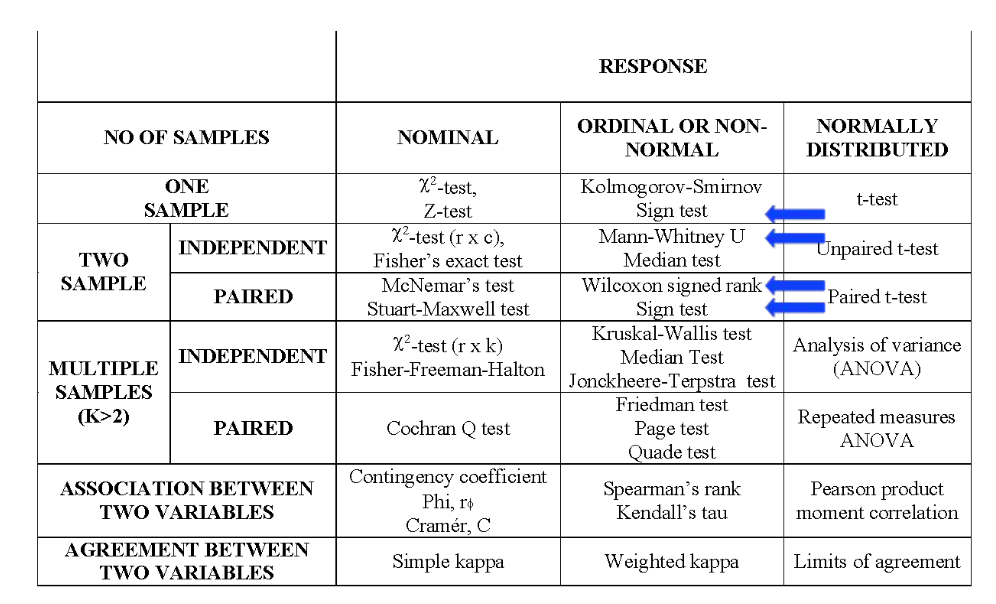
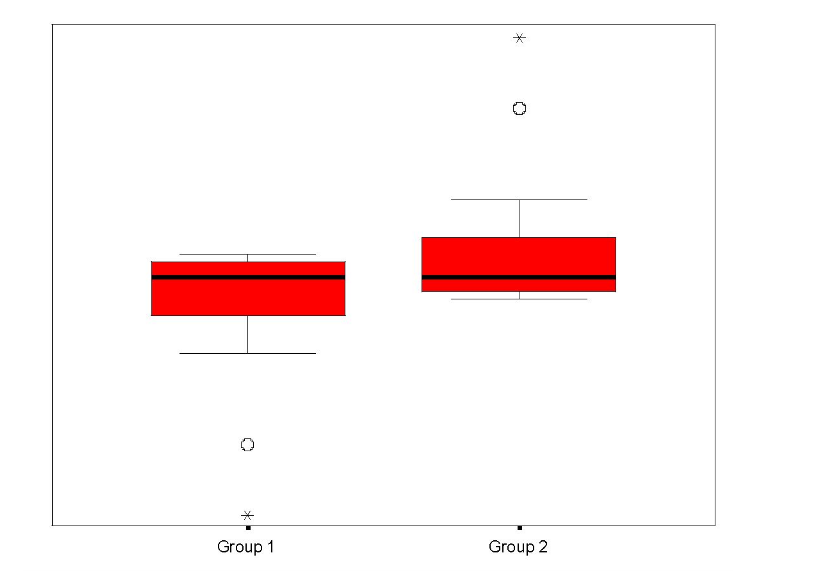

# Tests for continuous variables: non-parametric methods

## When to use which test

## When to use which test

## The sign-test

- A very simple non-parametric test
    + based on the Binomial distribution

- Uses directions of differences

- One-sample case: compares to fixed value

- Paired two-sample case: compares medians

## Sign-test

- Assumptions: 
    + Order in coding system (minimally requires ordinal data)
    + Randomly selected observations (independent)
    + For the two-sample case, requires paired data

- Hypotheses: 
    + $H_0$: medians in the two groups are equal
    + $H_A$: medians in the two groups differ
    
## Method: One-sample sign Test:

- Compare values to a specific value
    + "+" if bigger
    + "-" if smaller
    + "=" if equal
- Count the number of "+"'s and "-"'s and calculate
    + x = smallest of the positives and negatives
    + n = number of non-ties
- Compare to binomial tables
    + with p=0.5 (binomial success probability, not p-value!)
    
## One-Sample example

- General health section of SF-36 collected in a breast cancer study
- Expected value in general population 72

- Number of non–ties:     n = 14
- Number of negatives:     9
- Number of positives:     5 
- Look up n=14, p=0.5, x=5 in the binomial tables

## One-Sample example

- General health section of SF-36 collected in a breast cancer study
- Expected value in general population 72

- P = 0.42
- Therefore insufficient evidence to reject H0
- Conclusion: insufficient evidence to suggest that the median value is different from 72

## Method: two-sample sign test (paired data)

- Compare paired values between the two samples:
    + "+"     :    if the value in sample 1 is bigger
    + "–"     :    if the value in sample 1 is smaller
    + "="     :    if the value in the two samples is equal

- Count the number of +’s and -’s, and calculate:
    + x = smallest of the positives and negatives
    + n = number of non-ties

- Compare to binomial tables
    + With p = 0.5     (binomial success probability, not p-value)

## Two-sample Example

- General health values collected in same study at a 2nd time point
- Is there a difference between the time points?

- Number of non–ties:     n = 15
- Number of negatives:     12
- Number of positives:     3
-Look up n=15, p=0.5, x=3 in binomial tables

## Two-sample Example

- General health values collected in same study at a 2nd time point
- Is there a difference between the time points?

- P = 0.035, sufficient evidence to reject H0
- Conclusion: there is a difference in general health between the two time points

## Presentation of the results

- One-sample case:
    + "There is insufficient evidence to suggest a significant difference between the median general health value (60) observed in this sample and the value (72) observed in the general population (p=0.42, sign test)."

- Two-sample case:
    + "The median general health value observed at the second time point (70) was found to be significantly higher than the median (60) observed at the first time point (p=0.035, sign test)."

## Advantages and limitations

- Simple - few assumptions thus widely applicable

- Significance threshold can be adjusted

- Less powerful than other tests
    + Does not consider magnitude of differences
    + May fail to reject null hypothesis when other tests would achieve significance.
    
- Can be used for quick assessment of direction

## Wilcoxon signed rank test

- Alternative to sign test

- Assumptions: 
    + Paired data (e.g. matched samples, repeated measurements)
    + Each pair is independent
    + Continuous or ordinal data (Normality not assumed)
    + Symmetry of difference scores about true median difference (test by looking at histogram/boxplot)

- Hypothesis: 
    + $H_0$: sum of positive ranks equals sum of negative ranks
    + $H_A$: sum of positive ranks not equal to sum of negative ranks

## Method

- Calculate differences for each pair

- Rank the paired differences by magnitude

- Split the ranks into two groups:
    + positive and negative signed differences

- Calculate sum of positive ranks:    $W^+$

- Calculate sum of negative ranks:    $W^-$

- Compare smaller of and $W^+$ and $W^-$ to the critical value from the tables

## Example

- Taken from Glanz’ book, data correspond to urine production before/after diuretic
- Is there a difference?

## Example

- $W^+$ = 4, $W^-$=17
- Look-up W=4, n=6 in the tables

## Results

- Result: p=0.22
    + insufficient evidence to reject null hypothesis

- Conclusion: there is no evidence of a change in urine production before and after the drug

- Presentation of the results:
    + "The Wilcoxon signed rank test was unable to detect a significant change in urine production before and after treatment (W=4, p=0.22)".
    
## Advantages and Limitations

- Easy to apply
- Powerful
    + Utilises more information than the Sign test (but less than the paired t-test)
- Sometimes misinterpreted
    + Assumes symmetry of difference scores about the true median difference

## Mann-Whitney U test

- Also called the Wilcoxon Rank Sum test
- Assumptions: 
    + Two independent groups
    + At least ordinal dependent variable 
    + Randomly selected observations
    + Population distributions same shape
- Hypotheses: 
    + $H_0$: populations have the same median
    + $H_0$: populations have the same spread and shape

## Misunderstood test

Statistics  | Group 1 | Group 2
------------- | -------------|-------
Minimum  | 9.03 | 0.4
Median  | 9.94 | 9.94
Maximum | 19.48 | 10.85

Mann-Whitney U=303, p=0.03

## Method

- Construct hypotheses and decide on $\alpha$
- Rank whole sample from smallest to largest
- Assign average rank to ties
- Calculate sum of ranks for each group
- Calculate:

$$ U_1 = n_1n_2 + \frac{n_1(n_1+1)}{2} - R_1 $$

$$ U_2 = n_1n_2 + \frac{n_2(n_2+1)}{2} - R_2 $$

$U = min (U_1, U_2)$

- Compare U to critical value in the tables

## Example 

- Fisher’s book, coronary artery surgery study
- Exercise times in seconds, control and 3 vessel’s group
- Is there a difference in exercise times between the two groups, two-sided test

## Example 

- Fisher’s book, coronary artery surgery study
- Exercise times in seconds, control and 3 vessel’s group
- Is there a difference in exercise times between the two groups, two-sided test

- Sum of ranks: control group = 101, 3 vessels = 70

## Example

$$ U_1 = 8 \times 10 + \frac{8 (8+1)}{2} - 101 = 15 $$

$$ U_2 = 8 \times 10 + \frac{10 (10+1)}{2} - 70 = 65 $$

$$ U - min(U_1,U_2) = min(15,65) = 15$$

- Look-up $n_1$ = 8, $n_2$=10, p = 2.3 (as 2-sided)
- U = 15 < 17, from the tables
- Presentation of the results
    + "The Mann-Whitney U test showed that the individuals in the control group exercised for significantly longer than the individuals in the 3 vessels group (U=15, p=0.0025)"
    
## Advantages and limitations

- Almost as powerful as t-test
    + almost as likely as t-test to reject H$_0$ if false

- Sensitive to central tendencies of scores

- Often misinterpreted:
    + Difference in medians if same shape distributions
    + Otherwise tests for a combination of differences between the distributions, including spread and shape

## Summary: Two independent Samples

- ***t-test:*** 
    + Compares means when the data can be assumed to be Normally distributed.

- ***Mann-Whitney U test (Wilcoxon Rank Sum test):***   
    + Compares medians in two independent groups, without assuming Normality. However, does assume similarity of distributions. Otherwise, compares the shape and spread of the two groups, leading to potential misinterpretation of results.

## Summary: Paired Groups

-  ***One-sample Sign test: ***
    + Compares the median to a proposed value.

- ***Two-sample Sign test: ***
    + Compares the medians between matched pairs.

- ***Wilcoxon Signed Rank test: ***
    + Compares means, providing the distribution of differences is symmetric.

- ***Paired t-test: ***
    + Compares means, providing paired differences can be assumed to be Normally distributed.

