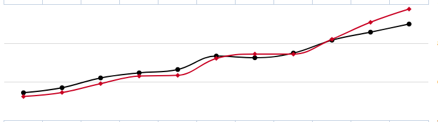
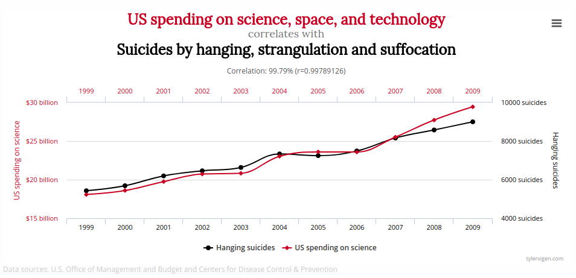
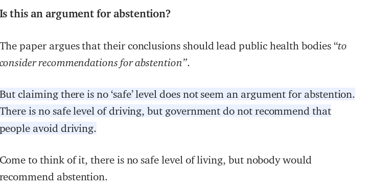

# Tests for categorical variables

```{r setup, include=FALSE}
knitr::opts_chunk$set(comment = NA,echo=FALSE,message=FALSE,warning = FALSE,fig.height=6)
```


```{r echo=FALSE,message=FALSE}
library(knitr)
library(ggplot2)
library(gridExtra)
```


## Associations between categorical variables

- All about frequencies!
- Row x Column table (2 x 2 simplest)
- Categorical data
- Look for association (relationship) between row variable and column variable
- N.B. we have already seen an example of this in the *Lady tasting tea* experiment

## Should you wear a bicycle helmet?

- In a study, 372 people wearing a helmet received head injuries compared to 267 that were not
    + but this does not show the full picture.
    
## Should you wear a bicycle helmet?

- It turns out that far more people in the study were wearing helmets
- Analysis on the data shows that a much higher proportion of the cyclists not wearing a helmet have a higher proportion of head injuries

```{r}
df <- data.frame(`Head Injury` = c(372,267), `Other Injury` = c(4715,1391))
rownames(df) <- c("Wearing Helmet","Not Wearing Helmet")
df
```

## Chi-square test

- E.g. Research question: A trial to assess the effectiveness of a new treatment versus a placebo in reducing tumour size in patients with ovarian cancer.

```{r}
df <- data.frame(`Tumour Did Not Shrink` = c(44,24), `Tumour Did Shrink` = c(40,16))
rownames(df) <- c("Treatment","Placebo")
df
```

- Is there an association between treatment group and tumour shrinkage
- Null hypothesis, $H_0$: No association
- Alternative hypothesis, $H_1$: Some association


## Chi-square test: calculating expected frequencies

```{r}
df2 <- cbind(df, rowSums(df))
df2 <- rbind(df2, colSums(df))
colnames(df2)[3] <- rownames(df2)[3] <- "Total"
df2
```

$$E = \frac{row total \times col total}{overall total} $$

- e.g. for row 1, column 1
$$\frac{84}{124} \times \frac{68}{124} \times 124 = \frac{84\times68}{124} = 46.1$$

    
## Chi-square test: calculating the chi-square statistic

***Observed frequencies:***

```{r}
csq <- chisq.test(df,correct = FALSE)
df
```

***Expected frequencies:***

```{r}
round(csq$expected,1)
```

$$\chi^2_1 = \frac{(44-46.06)^2}{46.06} + \frac{(40-37.94)^2}{37.94} + \frac{(24-21.94)^2}{21.94} + \frac{(16-18.06)^2}{18.06}$$

## Chi-square test

```{r,fig.width=4,fig.height=3}
degf <- csq$parameter

xmax <- max(4,csq$statistic)
xs <- seq(0, xmax, length.out = 10000)
df <- data.frame(X = xs, Y = dchisq(xs,degf))

title <- substitute(paste(chi^2, " with ", degf, " degrees of freedom"),list(degf=degf))

p <- ggplot(df, aes(x=X,y=Y)) + geom_line() + geom_vline(xintercept=csq$statistic,col="red") + xlim(0,xmax+1) + ggtitle(title)
p
pval <- round(csq$p.value,2)

```

Test statistic: ${\chi_1}^2$ = `r pval`
df = `r degf`
P-value = `r pval`

***Do not reject $H_0$ (No evidence of an association between treatment group and tumour shrinkage)***

## Limitations of the chi-square test

- In general, a Chi-square test is appropriate when:
    + at least 80% of the cells have an expected frequency of 5 or greater
    + none of the cells have an expected frequency less than 1 
- If these conditions aren’t met, ***Fisher’s exact test*** should be used.

## Same question, smaller sample size

- e.g. Research question: Is there an association between treatment group and tumour shrinkage?


```{r}
df <- data.frame(Tumour.Did.Not.Shrink = c(8,9), Tumour.Did.Shrink = c(3,4))
rownames(df) <- c("Treatment","Placebo")
df2 <- cbind(df, rowSums(df))
df2 <- rbind(df2, colSums(df))
colnames(df2)[3] <- rownames(df2)[3] <- "Total"
df2
```

- Null hypothesis: $H_0$: No association
- Alternative hypothesis: $H_1$: Some association

## Fishers' exact test; results

```{r}
exp <- round(chisq.test(df)$expected,1)
```

Expected frequencies:-

```{r}
exp
pv <- fisher.test(df)$p.value
```

- Test statistic: N/A
- P-value `r pv`
- Interpretation: ***Do not reject*** $H_0$ (No evidence of an association between treatment group and tumour shrinkage)

<!--
## Chi-square test for trend

- e.g. Research question: Is there a linear association between tumour grade and the incidence of tumour shrinkage

```{r}
df <- data.frame(Tumour.Did.Not.Shrink = c(18,15,11), Tumour.Did.Shrink = c(5,14,21))
rownames(df) <- c("Grade 1","Grade 2", "Grade 3")
df2 <- cbind(df, rowSums(df))
df2 <- rbind(df2, colSums(df))
colnames(df2)[3] <- rownames(df2)[4] <- "Total"
df2
```

- Null hypothesis: $H_0$: No linear association
- Alternative hypothesis: $H_1$: Some linear association

## Expected frequencies

```{r}
df2
```

Expected

```{r}
exp <- round(chisq.test(df)$expected,1)
exp
```


## Chi-square test for trend

```{r}
library(ggplot2)
df <- data.frame(Grade= rep(c(2,3,4),2), Proportion=c(0.4,0.4,0.4,0.2,0.4,0.6), Hypothesis=c(rep("Null",3),rep("Alternative",3)))
ggplot(df, aes(x=Grade, y=Proportion,col=Hypothesis)) + geom_line() + geom_point() + theme_bw()
```

## Chi-square test for trend; results

Test statistic: 10.18

DF = 1

P-value = 0.001

***Reject*** $H_0$ (evidence of a linear association between tumour grade and tumour shrinkage)

-->

## Summary - Categorical variables

- Chi-square test
    + Use when we have two categorical variables, each with two or more levels, and our expected frequencies are not too small. 

- Fishers exact test
    + Use when we have two categorical variables, each with two levels, and our expected frequencies are small. 
 
- (Chi-square test for trend)
    + Use when we have two categorical variables, where one or both are naturally ordered and the ordered variable has at least three levels, and our expected frequencies are not too small. 

- (McNemar’s test)
    + Use when we have two categorical paired variables.

## Summary - Categorical variables

- Turn scientific question to null and alternative hypothesis

- Calculate expected frequencies

- Think about test assumptions

- Carry out chi-square or Fishers test if appropriate

## Contingency table practical

- Complete contingency table practical

# Wrap-up

## Small group Exercise

- Inside the folder *mystery-data* you will find 8 csv files containing data for analysis
    + details are given in the practical
- Each group of 3/4 people will be assigned a dataset to analyse
- On this interactive document, describe how you approached the analysis, what test you used and your conclusions
    + https://public.etherpad-mozilla.org/p/2018-10-24-intro-to-stats

## Common pitfalls




## Common pitfalls

***Correlation does not equal causation***



## Common pitfalls


## Common pitfalls


## Common pitfalls

> David Spiegelhalter, Chair, Winton Centre for Risk and Evidence Communication




## Come speak to us


> "To consult the statistician after an experiment is finished is often merely to ask him to conduct a post mortem examination. He [/she] can perhaps say what the experiment died of" - R.A. Fisher

Design consultations available at Sheffield Bioinformatics Core:- bioinformatics-core@sheffield.ac.uk
