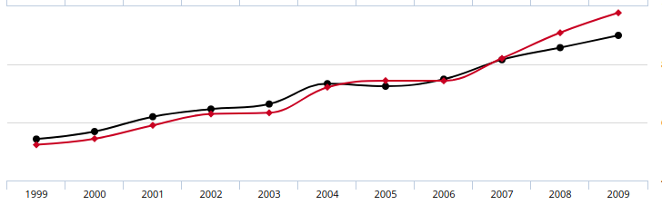
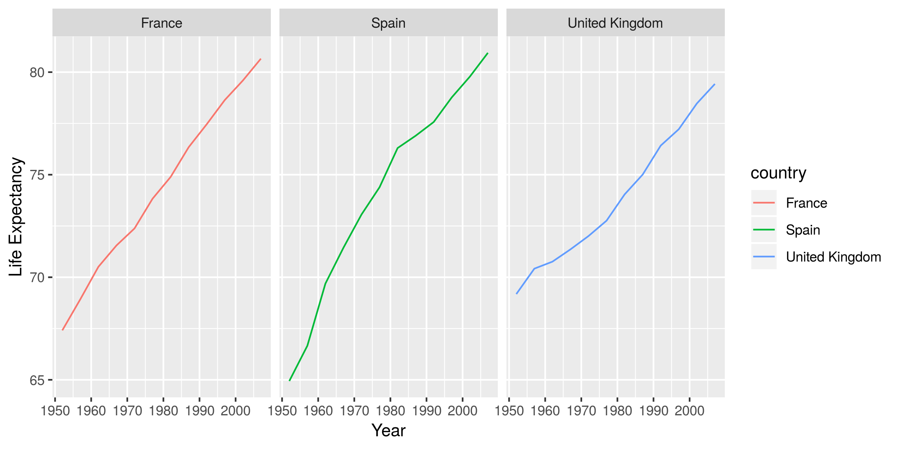

# Acknowledgement

These materials are adapted from a course developed at Cancer Research Uk Cambridge Institute by Mark Dunning, Matthew Eldridge and Thomas Carroll.

# R basics

## RStudio


- Rstudio is a free environment for R
- Convenient menus to access scripts, display plots
- Still need to use *command-line* to get things done
- Developed by some of the leading R programmers
- Used by beginners, and experienced users alike

To get started, you will need to install the [latest version of R](https://cran.r-project.org/) and [RStudio Desktop](https://www.rstudio.com/products/rstudio/download3/); both of which are ***free***. 

Once installed, you should be able to launch RStudio by clicking on its icon:-


## Entering commands in R

- The traditional way to enter R commands is via the Terminal, or using the console in RStudio (bottom-left panel when RStudio opens for first time).
  + this doesn't automatically keep track of the steps you did
- Alternative, an *R script* can be used to keep a record of the commands you used.
- The R code can be run from inside the script and the results are displayed in the console or Viewer panel (eg plots)
- Each line of R code can be executed by clicking on the line and pressing CTRL and ENTER
- Let's try this now!

<div class="alert alert-info">

#### **File -> New File -> R script > ** 

</div>


```{r}
print("Hello World")
```


# Getting started


At a basic level, we can use R as a calculator to compute simple sums with the `+`, `-`, `*` (for multiplication) and `/` (for division) symbols. 

```{r}
2 + 2
2 - 2
4 * 3
10 / 2
```

The answer is displayed at the console with a `[1]` in front of it. The `1` inside the square brackets is a place-holder to signify how many values were in the answer (in this case only one). We will talk about dealing with lists of numbers shortly...

In the case of expressions involving multiple operations, R respects the [BODMAS](https://en.wikipedia.org/wiki/Order_of_operations#Mnemonics) system to decide the order in which operations should be performed.

```{r}
2 + 2 *3
2 + (2 * 3)
(2 + 2) * 3
```

R is capable of more complicated arithmetic such as trigonometry and logarithms; like you would find on a fancy scientific calculator. Of course, R also has a plethora of statistical operations as we will see.


```{r}
pi
sin (pi/2)
cos(pi)
tan(2)
log(1)
```

We can only go so far with performing simple calculations like this. Eventually we will need to store our results for later use. For this, we need to make use of *variables*.

## Variables

A variable is a letter or word which takes (or contains) a value. We
use the assignment 'operator', `<-` to create a variable and store some value in it. 

```{r}
x <- 10
x
myNumber <- 25
myNumber
```
We also can perform arithmetic on variables using functions:

```{r}
sqrt(myNumber)
```

We can add variables together:
```{r}
x + myNumber
```


We can change the value of an existing variable:

```{r}
x <- 21
x
```

- We can set one variable to equal the value of another variable:

```{r}
x <- myNumber
x
```

- We can modify the contents of a variable:

```{r}
myNumber <- myNumber + sqrt(16)
myNumber
```

When we are feeling lazy we might give our variables short names (`x`, `y`, `i`...etc), but a better practice would be to give them meaningful names. There are some restrictions on creating variable names. They cannot start with a number or contain characters such as `.`, `_`, '-'. Naming variables the same as in-built functions in R, such as `c`, `T`, `mean` should also be avoided.

Naming variables is a matter of taste. Some [conventions](http://adv-r.had.co.nz/Style.html) exist such as a separating words with `-` or using *c*amel*C*aps. Whatever convention you decided, stick with it!

## Functions

**Functions** in R perform operations on **arguments** (the inputs(s) to the function). We have already used:

```{r}
sin(x)
```

this returns the sine of x. In this case the function has one argument: **x**. Arguments are always contained in parentheses -- curved brackets, **()** -- separated by commas.


Arguments can be named or unnamed, but if they are unnamed they must be ordered (we will see later how to find the right order). The names of the arguments are determined by the author of the function and can be found in the help page for the function. When testing code, it is easier and safer to name the arguments. `seq` is a function for generating a numeric sequence *from* and *to* particular numbers. Type `?seq` to get the help page for this function.

```{r}
seq(from = 3, to = 20, by = 4)
seq(3, 20, 4)
```

Arguments can have *default* values, meaning we do not need to specify values for these in order to run the function.

`rnorm` is a function that will generate a series of values from a *normal distribution*. In order to use the function, we need to tell R how many values we want

```{r}
## this will produce a random set of numbers, so everyone will get a different set of numbers
rnorm(n=10)
```

The normal distribution is defined by a *mean* (average) and *standard deviation* (spread). However, in the above example we didn't tell R what mean and standard deviation we wanted. So how does R know what to do? All arguments to a function and their default values are listed in the help page

(*N.B sometimes help pages can describe more than one function*)

```{r}
?rnorm
```

In this case, we see that the defaults for mean and standard deviation are 0 and 1. We can change the function to generate values from a distribution with a different mean and standard deviation using the `mean` and `sd` *arguments*. It is important that we get the spelling of these arguments exactly right, otherwise R will an error message, or (worse?) do something unexpected.

```{r}
rnorm(n=10, mean=2,sd=3)
rnorm(10, 2, 3)
```

In the examples above, `seq` and `rnorm` were both outputting a series of numbers, which is called a *vector* in R and is the most-fundamental data-type.


******
******
******


### Exercise


  - What is the value of `pi` to 3 decimal places?
    + see the help for `round` `?round`
  - How can we a create a sequence from 2 to 20 comprised of 5 equally-spaced numbers?
    + check the help page for seq `?seq`
  - Create a *variable* containing 1000 random numbers with a *mean* of 2 and a *standard deviation* of 3
    + what is the maximum and minimum of these numbers?
    + what is the average?
    + HINT: see the help pages for functions `min`, `max` and `mean`
    
```{r}


```
    
    
******
******
******

## Saving your script

If you want to re-visit your code at any point, you will need to save a copy.

<div class="alert alert-info">

#### **File > Save As... > ** 
_choose workshop material directory and Create a New Folder called `scripts`_

</div>


## Packages in R

So far we have used functions that are available with the *base* distribution of R; the functions you get with a clean install of R. The open-source nature of R encourages others to write their own functions for their particular data-type or analyses.

Packages are distributed through *repositories*. The most-common ones are CRAN and Bioconductor. CRAN alone has many thousands of packages.

The **Packages** tab in the bottom-right panel of RStudio lists all packages that you currently have installed. Clicking on a package name will show a list of functions that available once that package has been loaded. 

There are functions for installing packages within R. If your package is part of the main **CRAN** repository, you can use `install.packages`

We will be using the `tidyverse` R package in this practical. To install it, we would do.

```{r eval=FALSE}
install.packages("tidyverse")
```


A package may have several *dependencies*; other R packages from which it uses functions or data types (re-using code from other packages is strongly-encouraged). If this is the case, the other R packages will be located and installed too.

**So long as you stick with the same version of R, you won't need to repeat this install process.**


Once a package is installed, the `library` function is used to load a package and make it's functions / data available in your current R session. *You need to do this every time you load a new RStudio session*. Let's go ahead and load the `tidyverse`.


```{r}
## tidyverse is a collection of packages for data manipulation and visualisation
library(tidyverse)
```


# Dealing with data

The [***tidyverse***](https://www.tidyverse.org/) is in fact an eco-system of packages that provides a consistent, intuitive system for data manipulation and visualisation in R.


_Image Credit:_ [***Aberdeen Study Group***](https://aberdeenstudygroup.github.io/studyGroup/lessons/SG-T2-JointWorkshop/PopulationChangeSpeciesOccurrence/)

We are going to explore some of the basic features of the `tidyverse` using data from the [gapminder](https://www.gapminder.org/data/) project, which have been bundled into an [R package](https://github.com/jennybc/gapminder). These data give various indicator variables for different countries around the world (life expectancy, population and Gross Domestic Product). We have saved these data as a `.csv` file called `gapminder.csv` in a sub-directory called `raw_data/` to demonstrate how to import data into R.


You can download these data, along with the rest of the material needed for today's workshop and a copy of this handout  [here](https://github.com/sheffield-bioinformatics-core/r-crash-course/raw/master/CourseData.zip). Save the `.zip` file somewhere on your computer and unzip it.


## Working in Rstudio Projects

We are also going to be working in an Rstudio [Project](https://support.rstudio.com/hc/en-us/articles/200526207-Using-Projects). We suggest you **organize each data analysis into a project: a folder on your computer containing all files relevant to a particular piece of work.**

There are a number of benefits to this practice in general, and the Rstudio implementation in particular, summarised in Jenny Bryan's blogpost on [Project-oriented workflows](https://www.tidyverse.org/articles/2017/12/workflow-vs-script/).

In general makes work: 

- Self-contained
- Portable

RStudio fully supports Project-based workflows, making it easy to switch from one to another, have many projects open at once, re-launch recently used Projects, etc.

There are **a few ways to create new Projects**. We can start new Projects by creating a new directory. We can also **turn an existing directory into a Project**. Let's do this with the unzipped folder containing the workshop materials we just downloaded.


<div class="alert alert-info">

#### **File > New Project > Existing Directory > ...** 
_choose workshop material directory_

</div>

We've now turned our workshop material folder into an Rstudio project and launched it, which means:

- a **fresh R session has been launched** (see how the **Environment** tab is now clear)
- the **working directory has been set to the project root** (you can check this form the header on the Console tab)
- A project specific **History** is initiated.


## Working in R Notebooks

We'll also be working in an [**R Notebook**](https://bookdown.org/yihui/rmarkdown/notebook.html). These file are an [R Markdown](https://bookdown.org/yihui/rmarkdown/) document type, which allow us to **combine R code with** [markdown](https://pandoc.org/MANUAL.html#pandocs-markdown), **a documentation language**, providing a framework for [literate programming](https://en.wikipedia.org/wiki/Literate_programming).  In an R Notebook, R code chunks can be executed independently and interactively, with output visible immediately beneath the input.

**Let's open an R Notebook to start work in.**

<div class="alert alert-info">

#### **File > Open File >** 

- Navigate to the file `notes.Rmd` in the course materials

</div>

Each chunk of R code looks something like this.

    `r ''````{r}
    print('hello world!')
    ```

New R code chunks can be inserted by: 

- keyboard shortcut: `Ctrl + Alt + I` (macOS: `Cmd + Option + I`) 
- `Insert` menu in the editor toolbar.

Each line of R in the chunks can be again executed by clicking on the line or highlighting code and pressing `Ctrl + Enter` (macOS: `Cmd + Enter`), or you can press the green triangle on the right-hand side to run everything in the chunk.


_For more details, check out this [short tutorial](https://annakrystalli.me/literate-programming/) on literate programming in R Markdown_

Let's clear everything and write our first markdown and chunk of code by creating a `markdown` header with:

```
# Packages
```


and loading the tidyverse packages for the analysis in our notebook

    `r ''````{r load-packages}
    library("tidyverse")
    ```

```{r load-packages, message=FALSE}
library("tidyverse")
```

<br>


## Reading in data

Any `.csv` file can be imported into R by supplying the path to the file to `readr` function `read_csv` and assigning it to a new object to store the result. A useful sanity check is the `file.exists` function which will print `TRUE` is the file can be found in the working directory.

```{r}
gapminder_path <- "raw_data/gapminder.csv"
file.exists(gapminder_path)
```


Assuming the file can be found, we can use `read_csv` to import. Other functions can be used to read tab-delimited files (`read_delim`) or a generic `read.table` function. A data frame object is created.

```{r}
gapminder <- read_csv(gapminder_path)
```

<div class="alert alert-warning">

**Question: Why would specifying `gapminder_path` as **
```
gapminder_path <- "/Users/Anna/Documents/workflows/workshops/r-crash-course/raw_data/gapminder.csv"
```

**be a bad idea?**

</div>


The data frame object in R allows us to work with **"tabular" data**, like we might be used to dealing with in Excel, where our data can be thought of having **rows and columns**. The values in **each column** have to all be of the **same type** (i.e. all numbers or all text).

In Rstudio, you can **view the contents of the data frame** we have just created using function `View()`. This is useful for interactive exploration of the data, but not so useful for automation, scripting and analyses.

```{r eval=FALSE}
View(gapminder)
```

```{r, echo = FALSE}
gapminder
```


We should **always check the data frame that we have created**. Sometimes R will happily read data using an inappropriate function and create an object without raising an error. However, the data might be unsuable. Consider:-

```{r}
test <- read_table(gapminder_path)
```

```{r, eval=F}
View(test)
```

```{r, echo = FALSE}
test
```

Quick sanity checks can also be performed by inspecting details in the environment tab. 
 
## Manipulating data

We are going to use functions from the **`dplyr`** package (which is automatically loaded by loading the `tidyverse`) to **manipulate the data frame** we have just created. It is perfectly possible to work with data frames using the functions provided as part of "*base R*". However, many find it easy to read and write code using `dplyr`.

There are **many more functions available in `dplyr`** than we will cover today. An overview of all functions is given in the following [cheatsheet](https://www.rstudio.com/wp-content/uploads/2015/02/data-wrangling-cheatsheet.pdf)

### `select`ing columns


We can **access the columns** of a data frame using the `select` function. 

#### by name

Firstly, we can select column by name, by adding bare column names after the name of the data frame, separated by a `,` . 

```{r}
select(gapminder, country, continent)
```

We can also remove columns from by putting a minus (`-`) in front of the column name.

```{r}
select(gapminder, -country)
```

#### range of columns

A range of columns can be selected by the `:` operator.

```{r}
select(gapminder, lifeExp:gdpPercap)
```

#### helper functions 

There are a number of helper functions can be employed if we are unsure about the exact name of the column.

```{r}
select(gapminder, starts_with("life"))
select(gapminder, contains("pop"))
select(gapminder, one_of("pop", "country"))
```

### Restricting rows with filter

So far we have been returning all the rows in the output. We can use what we call a **logical test** to **filter the rows** in a data frame. This logical test will be applied to each row and give either a `TRUE` or `FALSE` result. When filtering, **only rows with a `TRUE` result get returned**.

For example we filter for rows where the **`lifeExp` variable is less than 40**. 

```{r}
filter(gapminder, lifeExp < 40)
```

Internally, R creates a *vector* of `TRUE` or `FALSE`; one for each row in the data frame. This is then used to decide which rows to display.

Testing for equality can be done using `==`. This will only give `TRUE` for entries that are *exactly* the same as the test string. 

```{r}
filter(gapminder, country == "Zambia")

```

N.B. For partial matches, the `grepl` function and / or *regular expressions* (if you know them) can be used.

```{r}
filter(gapminder, grepl("land", country))
```

We can also test if rows are *not* equal to a value using  `!=` 

```{r}
filter(gapminder, continent != "Europe")

```

#### testing more than one condition

There are a couple of ways of testing for more than one pattern. The first uses an *or* `|` statement. i.e. testing if the value of `country` is `Zambia` *or* the value is `Zimbabwe`. Remember to use double `=` sign to test for string equality; `==`.


```{r}
filter(gapminder, country == "Zambia" | country == "Zimbabwe")
```


The `%in%` function is a convenient function for testing which items in a vector correspond to a defined set of values.

```{r}
filter(gapminder, country %in% c("Zambia", "Zimbabwe"))
```


We can require that both tests are `TRUE`,  e.g. which years in Zambia had a life expectancy less than 40, by:

- using an *and* `&` operation.

```{r}
filter(gapminder, country == "Zambia" & lifeExp < 40)

```
Or just by separating conditional statemnets by a `,`

```{r}
filter(gapminder, country == "Zambia", lifeExp < 40)
```


******
******
******

#### Exercise

- Create a subset of the data where the population less than a million in the year 2002
- Create a subset of the data where the life expectancy is greater than 80 in the year 2002
- Create a subset of the **European** data where the life expectancy is greater than 80 in either the year 2002 *or* 2007

```{r}

```


******
******
******

### manipulating column values

As well as selecting existing columns in the data frame, new columns can be created and existing ones manipulated using the `mutate` function. Typically a function or mathematical expression to data in existing columns by row and the result either stored in a new column or reassigned to an existing one. In other words, the number of values returned by the function must be the same as the number of input values. Multiple mutations can be performed in one call.

Here, we create a new column of population in millions (`PopInMillions`) and round `lifeExp` to the nearest integer.

```{r}
mutate(gapminder, PopInMillions = pop / 1e6,
       lifeExp = round(lifeExp))

```

### Ordering and sorting

The whole data frame can be re-ordered according to the values in one column using the `arrange` function. So to order the table according to population size:-

```{r}
arrange(gapminder, pop)
```


The default is `smallest --> largest` by we can change this using the `desc` function

```{r}
arrange(gapminder, desc(pop))
```

`arrange` also works on character vectors, arrange them alpha-numerically.

```{r}
arrange(gapminder, desc(country))
```

We can even order by more than one condition

```{r}
arrange(gapminder, year, pop)
```


### saving data frames

A final point on data frames is that we can **write them to disk once we have done our data processing**. 

Let's create a folder in which to store such processed, analysis ready data

```{r, warning=FALSE, message=FALSE}
dir.create("data")
```


```{r}
byWealth <- arrange(gapminder, desc(gdpPercap))
head(byWealth)
write_csv(byWealth, path = ("data/by_wealth.csv"))
```

We will now try an exercise that involves using several steps of these operations

******
******
******

#### Exercise

- Filter the data to include just observations from the year 2002
- Order the table by increasing life expectancy
- Remove the year column from the resulting data frame
- Write the data frame out to a file in `data/` folder

```{r}


```


******
******
******


### "Piping"

We will **often need to perform an analysis, or clean a dataset, using several `dplyr` functions in sequence**. e.g. filtering, mutating, then selecting columns of interest (possibly followed by plotting - see later).

If we wanted to filter our results to just Europe and then also remove the now somewhat unnecessary `continent` column.

The following is perfectly valid R code, but invites the user to make mistakes when writing it. We also have to create multiple copies of the same data frame.

```{r}
tmp <- filter(gapminder, continent == "Europe")
tmp2 <- select(tmp, -continent)
```

Those familiar with Unix may recall that commands can be joined with a pipe; `|`

In R, `dplyr` commands to be linked together and form a workflow. The symbol `%>%` is pronounced **then**. With a `%>% ` the input to a function is assumed to be the output of the previous line. All the `dplyr` functions that we have seen so far take a data frame as an input and return an altered data frame as an output, so are ameanable to this type of programming.

The example we gave of filtering just the European countries and removing the `continent` column becomes:-

*notice that in the `select` statement we don't need to specify the name of the data frame*

```{r}
filter(gapminder, continent=="Europe") %>% 
  select(-continent)

```

We can join as many `dplyr` functions as we require for the analysis.

```{r}
filter(gapminder, continent=="Europe") %>% 
  select(-continent) %>% 
  mutate(lifeExp = round(lifeExp)) %>% 
  arrange(year, lifeExp) %>% 
  select(country, year:lifeExp) %>% 
  write_csv(path = "data/europe_by_lifeExp.csv")

```


# Plotting

The R language has extensive graphical capabilities.

Graphics in R may be created by many different methods including base graphics and more advanced plotting packages such as lattice.

The `ggplot2` package was created by Hadley Wickham and provides a intuitive plotting system to rapidly generate publication quality graphics.

`ggplot2` builds on the concept of the “Grammar of Graphics” (Wilkinson 2005, Bertin 1983) which describes a consistent syntax for the construction of a wide range of complex graphics by a concise description of their components.

## Why use ggplot2?

The structured syntax and high level of abstraction used by ggplot2 should allow for the user to concentrate on the visualisations instead of creating the underlying code.

On top of this central philosophy ggplot2 has:

- Increased flexibility over many plotting systems.
- An advanced theme system for professional/publication level graphics.
- Large developer base – Many libraries extending its flexibility.
- Large user base – Great documentation and active mailing list.


It is always useful to think about the message you want to convey and the appropriate plot before writing any R code. Resources like [this](https://www.data-to-viz.com/) should help.

With some practice, `ggplot2` makes it easier to go from the figure you are imagining in our head (or on paper) to a publication-ready image in R.

As with `dplyr`, we won't have time to cover all details of `ggplot2`. This is however a useful [cheatsheet](https://www.rstudio.com/wp-content/uploads/2015/03/ggplot2-cheatsheet.pdf) that can be printed as a reference.

## Basic plot types

A plot in `ggplot2` is created with the following type of command

```
ggplot(data = <DATA>, mapping = aes(<MAPPINGS>)) +  <GEOM_FUNCTION>()
```

So we need to specify

- The data to be used in graph
- Mappings of data to the graph (*aesthetic* mapping)
- What type of graph we want to use (The *geom* to use).

Lets say that we want to explore the relationship between GDP and Life Expectancy. We might start with the hypothesis that richer countries have higher life expectancy. A sensible choice of plot would be a *scatter plot* with gdp on the x-axis and life expectancy on the y-axis.

The first stage is to specify our dataset

```{r}
library(ggplot2)
ggplot(data = gapminder)
```

For the aesthetics, as a bare minimum we will map the `gdpPercap` and `lifeExp` to the x- and y-axis of the plot

```{r}
ggplot(data = gapminder,aes(x=gdpPercap, y=lifeExp))
```

That created the axes, but we still need to define how to display our points on the plot. As we have continuous data for both the x- and y-axis, `geom_point` is a good choice.

```{r}
ggplot(data = gapminder,aes(x=gdpPercap, y=lifeExp)) + geom_point()
```


The *geom* we use will depend on what kind of data we have (continuous, categorical etc)

- `geom_point()` - Scatter plots
- `geom_line()` - Line plots
- `geom_smooth()` - Fitted line plots
- `geom_bar()` - Bar plots
- `geom_boxplot()` - Boxplots
- `geom_jitter()` - Jitter to plots
- `geom_histogram()` - Histogram plots
- `geom_density()` - Density plots
- `geom_text()` - Text to plots
- `geom_errorbar()` - Errorbars to plots
- `geom_violin()` - Violin plots
- `geom_tile()` - for "heatmap"-like plots


Boxplots are commonly used to visualise the distributions of continuous data. We have to use a categorical variable on the x-axis. In the case of the `gapminder` data we might have to persuade `ggplot2` that the `year` column is a `factor` rather than numerical data.

```{r}
ggplot(gapminder, aes(x = as.factor(year), y=gdpPercap)) + geom_boxplot()
```


```{r}
ggplot(gapminder, aes(x = gdpPercap)) + geom_histogram()
```

Counts with a barplot

```{r}
ggplot(gapminder, aes(x=continent)) + geom_bar()
```

Where appropriate, we can add multiple layers of `geom`s to the plot. For instance, a criticism of the boxplot is that it does not show all the data. We can rectify this by overlaying the individual points.

```{r}
ggplot(gapminder, aes(x = as.factor(year), y=gdpPercap)) + geom_boxplot() + geom_point()
```

```{r}
ggplot(gapminder, aes(x = as.factor(year), y=gdpPercap)) + geom_boxplot() + geom_jitter(width=0.1)
```


******
******
******

### Exercises


- The violin plot is a popular alternative to the boxplot. Create a violin plot with `geom_violin` to visualise the increase in GDP over time.
- Create a subset of the `gapminder` data frame containing just the rows for your country of birth
- Has there been an increase in life expectancy over time?
    + visualise the trend using a scatter plot (`geom_point`), line graph (`geom_line`) or smoothed line (`geom_smooth`).


******
******
******

As we have seen already, `ggplot` offers an interface to create many popular plot types. It is up to the user to decide what the best way to visualise the data.

It is also up to the user how to interpret the data. Consider the following plot and what message it might be conveying. 



However, when considering [the source of the plot](http://www.tylervigen.com/spurious-correlations) your interpretation might change.

## Customising the plot appearance

Our plots are a bit dreary at the moment, but one way to add colour is to add a `col` argument to the `geom_point` function. The value can be any of the pre-defined colour names in R. These are displayed in this [handy online reference](http://www.stat.columbia.edu/~tzheng/files/Rcolor.pdf). *R*ed, *G*reen, *B*lue of *Hex* values can also be given.

```{r}
ggplot(gapminder, aes(x = gdpPercap, y=lifeExp)) + geom_point(col="red")
```

However, a powerful feature of `ggplot2` is that colours are treated as aesthetics of the plot. In other words we can use column in our dataset.

Let's say that we want points on our plot to be coloured according to continent. We add an extra argument to the definition of aesthetics to define the mapping. `ggplot2` will even decide on colours and create a legend for us.

```{r}
ggplot(gapminder, aes(x = gdpPercap, y=lifeExp,col=continent)) + geom_point()
```


<div class="alert alert-warning">

**Question: Can you explain why the colour scheme used on the following two plots are different**

</div>

```{r}
ggplot(gapminder, aes(x = gdpPercap, y=lifeExp,col=year)) + geom_point()
ggplot(gapminder, aes(x = gdpPercap, y=lifeExp,col=as.factor(year))) + geom_point()
```

Shape and size of points can also be mapped from the data. However, it is easy to get carried away.

```{r}
ggplot(gapminder, aes(x = gdpPercap, y=lifeExp,shape=continent,size=pop,col=as.factor(year))) + geom_point()
```

Scales and their legends have so far been handled using ggplot2 defaults. ggplot2 offers functionality to have finer control over scales and legends using the scale methods.

Scale methods are divided into functions by combinations of

- the aesthetics they control.

- the type of data mapped to scale.

`scale_`*aesthetic*_*type*

Try typing in `scale_` then tab to autocomplete. This will provide some examples of the scale functions available in `ggplot2`.

Although different scale functions accept some variety in their arguments, common arguments to scale functions include -

- name - The axis or legend title

- limits - Minimum and maximum of the scale

- breaks - Label/tick positions along an axis

- labels - Label names at each break

- values - the set of aesthetic values to map data values

We can choose specific colour palettes, such as those provided by the `RColorBrewer` package. This package provides palettes for different types of scale (sequential, diverging, qualitative).

```{r}
library(RColorBrewer)
display.brewer.all()
```


```{r}
ggplot(gapminder, aes(x = gdpPercap, y=lifeExp,col=continent)) + geom_point() + scale_color_brewer(palette = "Set2")
```

Or we can even specify our own colours; such as The University of Sheffield branding colours

```{r}
my_pal <- c(rgb(0,159,218,maxColorValue = 255),
            rgb(31,20,93,maxColorValue = 255),
            rgb(249,227,0,maxColorValue = 255),
            rgb(0,155,72,maxColorValue = 255),
            rgb(190,214,0,maxColorValue = 255))
ggplot(gapminder, aes(x = gdpPercap, y=lifeExp,col=continent)) + geom_point() + scale_color_manual(values=my_pal)

```

You will often see `ggplots` saved as a variable, which allows us to experiement with some of the layouts, themes and plotting options.

```{r}
p <- ggplot(gapminder, aes(x = gdpPercap, y=lifeExp,col=continent)) + geom_point() + scale_color_brewer(palette = "Set2")
p
```

Various labels can be modified using the `labs` function.

```{r}
p + labs(x="Wealth",y="Life Expectancy",title="Relationship between Wealth and Life Expectancy")
```

We can also modify the x- and y- limits of the plot so that any outliers are not shown. `ggplot2` will give a warning that some points are excluded.

```{r}
p + xlim(0,60000)
```

Saving is supported by the `ggsave` function.

```{r}

ggsave(p, file="my_ggplot.png")
```

Most aspects of the plot can be modified from the background colour to the grid sizes and font. Several pre-defined "themes" exist and we can modify the appearance of the whole plot using a `theme_..` function.

```{r}
p + theme_bw()
```

More themes are supported by the `ggthemes` package. You can make your plots look like the Economist, Wall Street Journal or Excel (**but please don't do this!**)

## Facets

One very useful feature of ggplot is faceting. This allows you to produce plots subset by variables in your data. In the scatter plot above, it was quite difficult to see if the relationship between gdp and life expectancy was the same for each continent. To overcome this, we would like a see a separate plot for each continent.

To facet our data into multiple plots we can use the `facet_wrap` or `facet_grid` function and specify the variable we split by. 

```{r}
ggplot(gapminder, aes(x = gdpPercap, y=lifeExp,col=continent)) + geom_point() + facet_wrap(~continent)

```

The `facet_grid` function will create a grid-like plot with one variable on the x-axis and another on the y-axis.

```{r fig.width=12}
ggplot(gapminder, aes(x = gdpPercap, y=lifeExp,col=continent)) + geom_point() + facet_grid(continent~year)
```


The previous plot was a bit messy as it contained all combinations of year and continent. Let's suppose we want our analysis to be a bit more focussed and disregard countries in Oceania (as there are only 2 in our dataset) and years between 1997 and 2002. We should know how to restrict the rows from the `gapminder` dataset using the `filter` function. Instead of filtering the data, creating a new data frame and construcing the data frame from these new data we can use the` %>%` operator to create the data frame on the fly and pass directly to `ggplot`. Thus we don't have to save a new data frame or alter the original data.


```{r fig.width=12}
filter(gapminder, continent!="Oceania", year %in% c(1997,2002,2007)) %>% 
  ggplot(aes(x = gdpPercap, y=lifeExp,col=continent)) + geom_point() + facet_grid(continent~year)
```

******
******
******

### Exercise

- In a previous exercise we filtered the gapminder data to a particular country of interest, and then plotted the trend in life expectancy over time
- Repeat this plot, but selecting three countries of interest and using piping `%>%` to avoid creating an intermediate data frame
- Use a *facet* to split into separate plots 
- See below for an example



******
******
******


# Summarising and grouping with dplyr

The `summarise` function can take any R function that takes a vector of values (i.e. a column from a data frame) and returns a single value. Some of the more useful functions include:

- `min` minimum value
- `max` maximum value
- `sum` sum of values
- `mean` mean value
- `sd` standard deviation
- `median` median value
- `IQR` the interquartile range
- `n_distinct` the number of distinct values
- `n` the number of observations (Note: this is a special function that doesn’t take a vector argument, i.e. column)


```{r}
summarise(gapminder, min(lifeExp), max(gdpPercap), mean(pop))
```

It is also possible to summarise using a function that takes more than one value, i.e. from multiple columns. For example, we could compute the correlation between year and life expectancy. Here we also assign names to the table that is produced.

```{r}
gapminder %>% 
summarise(MinLifeExpectancy = min(lifeExp), 
          MaximumGDP = max(gdpPercap), 
          AveragePop = mean(pop), 
          Correlation = cor(year, lifeExp))
```

However, it is not particularly useful to calculate such values from the entire table as we have different continents and years. The `group_by` function allows us to split the table into different categories, and compute summary statistics. We can group the data according to year and compute the 

```{r}
gapminder %>% 
    group_by(year) %>% 
    summarise(MinLifeExpectancy = min(lifeExp), 
              MaximumGDP = max(gdpPercap), 
              AveragePop = mean(pop))
```

The nice thing about `summarise` is that it can followed up by any of the other `dplyr` verbs that we have met so far (`select`, `filter`, `arrange`..etc). 

Returning to the correlation between life expectancy and year, we can summarise as follows:-

```{r}
gapminder %>%     
    group_by(country) %>% 
    summarise(Correlation = cor(year , lifeExp))
```
We can then arrange the table by the correlation to see which countries have the lowest correlation

```{r}
gapminder %>%      
    group_by(country) %>% 
    summarise(Correlation = cor(year , lifeExp)) %>% 
    arrange(Correlation)
```

We can filter the results to find obsevations of interest

```{r}
gapminder %>%      
    group_by(country) %>% 
    summarise(Correlation = cor(year , lifeExp)) %>% 
    filter(Correlation < 0)
```

The countries we identify could then be used as the basis for a plot.

```{r}
filter(gapminder, country %in% c("Rwanda","Zambia","Zimbabwe")) %>% 
  ggplot(aes(x=year, y=lifeExp,col=country)) + geom_line()
``` 

# Joining

In many real life situations, data are spread across multiple tables or spreadsheets. Usually this occurs because different types of information about a subject, e.g. a patient, are collected from different sources. It may be desirable for some analyses to combine data from two or more tables into a single data frame based on a common column, for example, an attribute that uniquely identifies the subject.

`dplyr` provides a set of join functions for combining two data frames based on matches within specified columns. For those familiar with such SQL, these operations are very similar to carrying out join operations between tables in a relational database.

As a toy example, lets consider two data frames that contain the names of various bands, and the instruments that they play:-
```{r}
band_instruments
band_members
```

There are various ways in which we can join these two tables together. We will just consider the case of a "left join".


*Animated gif by Garrick Aden-Buie*

`left_join` returns all rows from the first data frame regardless of whether there is a match in the second data frame. Rows with no match are included in the resulting data frame but have NA values in the additional columns coming from the second data frame.

Animations to illustrate other types of join are available at [https://github.com/gadenbuie/tidy-animated-verbs](https://github.com/gadenbuie/tidy-animated-verbs)

```{r}
left_join(band_members, band_instruments)
```

`right_join` is similar but returns all rows from the second data frame that have a match with rows in the first data frame based on the specified column.

```{r}
right_join(band_members, band_instruments)
```

`inner_join` only returns those rows where matches could be made

```{r}
inner_join(band_members, band_instruments)
```
******
******
******

### Exercise (open-ended)

- The file `medal_table.csv` in the `raw_data/` project sub-directory contains data about how many medals how been won by various countries at the Beijing summer olympics of 2008.
- Read this csv file into R and join with the `gapminder` data from 2007
- What interesting summaries / plots can you make from the data? For example...
  + what countries have the greatest percentage of gold medals (ignore countries with too few medals)
  + calculate the number of medals won per million people and re-arrange by this new measure. What countries perform best?
  + how similar is the distribution of total medals between continents?
  + do countries with a larger population tend to win more medals?
  + do countries with larger GDP tend to win more medals
  + are these trends consistent among different continents?
  
******
******
******


